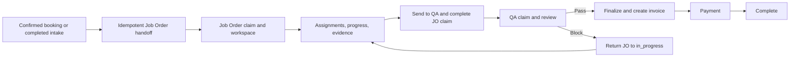
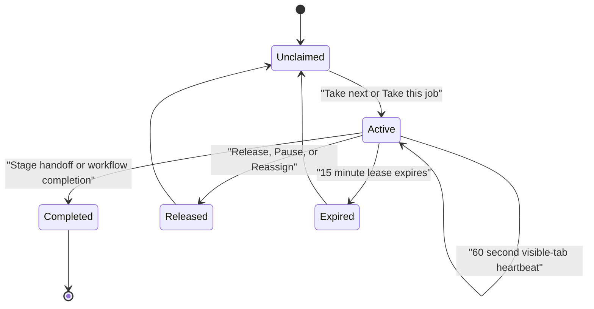

# AUTOCARE Critical Workflow Implementation Plan

Status: Ready for implementation

Evidence snapshot: 2026-07-27

Primary evidence: `docs/project-control/evidence/autocare-detailed-context-2026-07-27/README.md`

## 1. Executive Decisions

### Objective

Make Booking/Intake to Job Order to QA to Finalization to Payment reliable, concurrent, understandable, and testable without replacing the existing application, routes, statuses, or deployment topology.

### Critical problems and selected solutions

| Problem | Decision |
| --- | --- |
| QA can show the previous passed record after the next record is claimed. | Make QA selection controlled by the workspace, key all detail/draft state by Job Order ID, abort superseded requests, and discard responses whose request epoch or entity ID is stale. |
| Claim-protected operations can proceed through compatibility fail-open paths. | Make the claim guard dependency mandatory and require a matching active `x-work-claim-id` for every staff workflow mutation listed below. |
| QA decisions can be overwritten without mandatory concurrency control. | Require `If-Match`, allow a normal verdict only from `pending`, retain existing blocked-gate override, and add an audited super-admin reopen operation for an incorrect released verdict. |
| Invoice creation and Job Order finalization can partially commit. | Lock and finalize the Job Order and invoice in one database transaction; make finalization idempotent per Job Order and idempotency key; track PDF generation separately and retry it through the existing job infrastructure. |
| Queue pagination changes underneath staff. | Replace offset cursors with versioned keyset cursors and indexed operational filters while keeping the existing endpoint and a temporary offset compatibility decoder. |
| Claim concurrency is not proven. | Add PostgreSQL-backed concurrent tests using three independent users and real transactions before changing dispatch behavior. |
| Audit history is fragmented. | Add one append-only Job Order activity table and project existing workflow events into a read-only timeline. This is an operational audit log, not event sourcing. |
| Staff role descriptions drift across generated and mobile code. | Enforce service adviser/super admin on staff web, customer on mobile, and technician as a non-login profile. |

### Explicitly rejected alternatives

- No rewrite, microservice split, event-sourced aggregate, new frontend framework, or new state-management library.
- No generic enterprise event platform or generic outbox in Release 1. The finalization transaction and artifact retry solve the confirmed failure with less operational surface.
- No WebSocket queue replacement. Existing polling, atomic claims, leases, and heartbeat are sufficient after correctness and test coverage are fixed.
- No infinite scrolling or client-side loading of the complete queue.
- No production staffing or SLA decisions based on seeded local timings.
- No broad redesign of Inventory, Insurance, Ecommerce, Analytics, or unrelated mobile features.
- No visual redesign before workflow correctness and data contracts are stable.

### Compatibility constraints

- Preserve `/admin/job-orders`, `/admin/job-orders/[id]`, `/admin/qa-audit`, current backend path names, current Job Order statuses, and Railway service boundaries.
- Add fields and endpoints compatibly; do not rename persisted statuses during this program.
- Use one temporary `WORKFLOW_STRICT_CONCURRENCY` setting. Tests and local development default to `true`. Production starts `false`, moves to `true` after the compatible web client is deployed and verified, and the flag is removed one release later.
- Existing offset cursors remain readable for one release. Every newly returned cursor is keyset version 1.
- Database changes use committed incremental Drizzle migrations and are validated against an empty database and a copy of the current schema.

## 2. Confirmed Findings

| ID | Severity | Finding and evidence | Root cause | Immediate containment |
| --- | --- | --- | --- | --- |
| F-01 | P0 | The QA queue advances after Pass while detail can retain the previous record. Reproduced in `screenshots/qa-after-pass-verdict.png`. | Overlapping queue/detail requests and shared unkeyed component state permit an old response to win. | Staff must verify queue and detail references match; pause/reload if they differ. Disable verdict whenever IDs do not match. |
| F-02 | P0 | Claim access has fail-open compatibility behavior. | `assertClaimAccess` accepts the no-active-claim/no-header case, and the guard dependency is optional. | Add server warning telemetry immediately, then enable strict mode after client rollout. |
| F-03 | P0 | A released QA verdict can be overwritten, and `If-Match` is optional. | No terminal-state predicate and no mandatory expected version. | Require record ID, active claim, and loaded version to match in the UI before submission. |
| F-04 | P0 | Finalization can create an invoice and fail before Job Order state and artifacts are consistent. | Invoice insert, Job Order update, and artifact side effects are not one durable operation. | Treat duplicate invoice responses as potentially committed work and re-read authoritative state before retry. |
| F-05 | P1 | Queue pages are bounded to 25 records but use offset semantics. | Opaque cursor decodes to an offset and filters are incomplete. | Keep the bounded page; avoid adding larger page-size options. |
| F-06 | P1 | Three-worker claim, expiry, heartbeat, selected-record conflict, and auto-dispatch behavior lacks a dedicated suite. | Current tests focus on Job Order and QA domain behavior, not concurrent queue transactions. | Do not alter dispatch ordering before the concurrency suite is green. |
| F-07 | P1 | Generated descriptions and mobile tests still reference retired authenticated technician roles. | Contract/test artifacts outlived the current role boundary. | Treat controller guards and canonical context as authoritative. |
| F-08 | P1 | Job Order operational history must be reconstructed from several stores. | Progress, claim, QA, invoice, and event history are separate and partly mutable. | Preserve current records; do not delete history during refactoring. |
| F-09 | P2 | QA, Job Order, queue repository, and mobile dashboard modules are oversized. | Rendering, transport, orchestration, compatibility, and business logic accumulated in shared files. | Characterize behavior first and prohibit unrelated growth in these files. |

Evidence and source-level detail are maintained in:

- `docs/project-control/evidence/autocare-detailed-context-2026-07-27/stuck-scenarios-and-findings.md`
- `docs/project-control/evidence/autocare-detailed-context-2026-07-27/file-inventory.md`
- `docs/project-control/evidence/autocare-detailed-context-2026-07-27/verification-and-scale.md`

## 3. Current and Target Workflow

### Current workflow



Current failure points:

- queue selection and detail rendering can disagree;
- ownership authorization can be bypassed through compatibility paths;
- normal QA verdicts are not terminal;
- finalization persistence and artifact generation can report partial success as failure;
- blocked work does not guarantee reassignment to the previous person;
- offset pages can move while the queue changes.

### Target workflow and ownership

| Stage | Record owner | Active claim | Completion behavior |
| --- | --- | --- | --- |
| Booking/Intake handoff | Service adviser initiating handoff | None required for idempotent handoff | Create or return existing Job Order and open workspace. |
| Workshop setup through evidence | Service adviser; technician profiles are assignees only | Job Order claim required for mutations | Satisfy assignment, completion, progress, and evidence gates. |
| QA handoff | Sending service adviser | Existing Job Order claim | Begin/resume quality gate, complete Job Order claim, show handoff receipt. |
| QA review | QA-capable service adviser or super admin | QA claim required for verdict | Pass or Block once using expected version; complete QA claim. |
| QA correction | Job Order adviser when available; otherwise unassigned team queue | New Job Order claim required | Show QA reason and required correction; resubmit through normal evidence gates. |
| Finalization | Owning service adviser or super admin | New Job Order claim required | Transactionally finalize and create/read the one invoice record. |
| Payment | Authorized staff payment flow/provider webhook | No queue claim for provider webhook; staff mutation follows invoice ownership policy | Record or reconcile payment after finalization. |
| History | Read-only viewers allowed by current RBAC | No active claim | No workflow controls are mounted. |

### Claim lifecycle



Rules:

- one active claim per owner per queue;
- one active claim per queue/entity;
- one person may hold one Job Order claim and one QA claim;
- tab closure relies on lease expiry because unload release is not reliable;
- reconnect refreshes authoritative claim state before enabling mutations;
- admin reassignment requires an audit reason;
- completion may return a next claim only when the session is accepting work.

## 4. Implementation Design

### Race-safe QA detail

- `QAAuditWorkspace` becomes the sole owner of selected/claimed Job Order ID.
- Detail state shape is `{ entityId, requestEpoch, status, gate, error }`.
- Verdict draft state is keyed by entity ID, not shared across selections.
- Each load increments `requestEpoch`, aborts the previous request, and applies a response only when both epoch and entity ID match current selection.
- `StaffWorkQueue` emits selection/claim events but does not independently load QA detail.
- Pass/Block is enabled only when selected ID, active claim entity ID, loaded gate Job Order ID, and loaded gate version are all present and equal.
- After a verdict, the old detail is cleared before processing `nextClaim`; a completion receipt remains keyed to the completed reference.

### Fail-closed claim authorization

Strict mode applies to staff-authored mutations for:

- Job Order assignments, status/stage, progress, evidence/photo mutation, QA handoff, and finalization;
- QA reviewer verdict;
- staff claim heartbeat, release, and completion operations already scoped to a claim.

Strict mode does not apply to:

- read-only GETs;
- idempotent Booking/Intake handoff before a Job Order enters staff queue ownership;
- super-admin QA override/reopen, which uses role, reason, version, and audit controls;
- payment-provider webhooks;
- customer-facing reads;
- background artifact retry.

The guard must:

1. require the queue service at Nest construction time;
2. require `x-work-claim-id`;
3. verify active status, queue type, entity ID, owner ID, and unexpired lease;
4. return stable conflict codes without exposing private staff data;
5. attach validated claim context to the request for the service layer.

### Immutable and version-controlled QA decisions

- `PATCH /api/job-orders/{jobOrderId}/qa/verdict` retains its path.
- `If-Match` is mandatory in strict mode and carries the integer quality-gate version.
- Normal Pass/Block succeeds only when reviewer verdict is `pending`, gate version matches, and claim is active.
- The repository update includes pending state and expected version in one predicate.
- A successful decision inserts an immutable decision revision, updates the current gate projection, increments version, and completes the QA claim in one database transaction.
- After that transaction commits, auto-dispatch runs in a separate queue transaction. Dispatch failure does not roll back the verdict; the response returns `nextClaim: null` and the staff member can use `Take next`.
- Existing blocked-gate override remains super-admin only, requires reason, and is immutable history.
- Add `POST /api/job-orders/{jobOrderId}/qa/reopen`: super admin only, `If-Match` required, reason 8-1000 characters, preserves the prior decision, increments version, returns the Job Order to `ready_for_qa`, and creates a new pending review revision. It never edits or deletes the prior verdict.

Add `quality_gate_decision_revisions`:

- `id`, `qualityGateId`, `revision`, `action` (`verdict`, `reopen`);
- `previousStatus`, `nextStatus`, `verdict`, `note`, `reason`;
- `actorUserId`, `actorRole`, `claimId`, `createdAt`.

Use a unique `(quality_gate_id, revision)` index. The existing gate row remains the current-state projection; the revision table is append-only and becomes the source for decision history.

Reopen is rejected after the Job Order is finalized or paid. A successful reopen sets the current gate projection to pending review, clears its current reviewer identity/note/time, increments version, and leaves the prior verdict in the revision table. Existing blocked-gate overrides continue to use `quality_gate_overrides`; the timeline later reads both immutable sources.

### Transactional, idempotent finalization

- `POST /api/job-orders/{id}/finalize` retains its path.
- Require Job Order claim, `If-Match` Job Order version, and `Idempotency-Key`.
- Lock/re-read the Job Order inside one database transaction.
- Revalidate `ready_for_qa`, all items complete, gate passed/overridden, and adviser ownership.
- Insert or read the unique invoice record, update Job Order to finalized, increment version, and append an activity event in the same transaction.
- Accept idempotency keys of 16-128 visible ASCII characters and store the key on the invoice record with a unique index. Repeating the same request returns the same result with `replayed: true`. A later key for an already finalized Job Order also returns the authoritative existing invoice with `created: false`; it does not create a second invoice.
- Add invoice artifact fields: `pdfStatus` (`pending`, `ready`, `failed`), `pdfAttemptCount`, `pdfLastErrorCode`, `pdfNextRetryAt`, and `pdfUpdatedAt`.
- After commit, enqueue an idempotent PDF job using invoice ID as job ID. Retry after 1 minute, 5 minutes, 30 minutes, 2 hours, and 12 hours. A 10-minute sweeper recovers stale pending work and due failed work.
- After five failed attempts, keep `pdfStatus: failed`. Add `POST /api/job-orders/{id}/invoice/pdf/retry` for a super admin or owning adviser. It resets the bounded attempt cycle and enqueues the invoice job without changing finalization.
- Email/notification failure never changes finalization success. It is logged and retried independently.

### Deterministic queue engine and keyset pages

- Keep `GET /api/staff-work-queues/:queueType`.
- Default page size remains 25; maximum is 100 for approved administrative exports only, never the operational board.
- Add filters: `stage`, `ownerUserId`, `technicianProfileId`, `scheduledFrom`, `scheduledTo`, `jobType`, `blocker`, `overdue`, `riskMin` (QA only), and `sort`.
- Allowed sorts are `dispatch` (default), `waiting_oldest`, `scheduled_soonest`, and `risk_highest` (QA only).
- `dispatch` preserves the current server dispatch policy as `dispatchRank DESC, waitingSince ASC, entityId ASC`; the refactor must characterize the current rank before moving the query.
- `waiting_oldest` uses `waitingSince ASC, entityId ASC`; `scheduled_soonest` uses `scheduledDate ASC NULLS LAST, entityId ASC`; `risk_highest` uses `riskScore DESC, waitingSince ASC, entityId ASC`.
- Cursor is base64url JSON `{ "v": 1, "sort": "...", "direction": "next|previous", "filterHash": "...", "values": [...], "id": "..." }`.
- `filterHash` is SHA-256 over the canonical JSON representation of normalized queue type, view, search, filters, and sort. Malformed, unsupported, or filter-mismatched cursors return `INVALID_QUEUE_CURSOR`.
- Response includes `items`, aggregate `counts`, `currentClaim`, `session`, and `pageInfo` with next/previous cursors and boolean bounds.
- Dispatch uses the same eligibility and ordering policy as the queue view, performs selection and claim insert in one transaction, and retries only recognized unique-claim contention.

### Focused staff UX

- My Work shows Job Order and QA claims independently, their lease health, assigned corrections, blockers, and direct Resume actions.
- Send to QA displays a receipt naming the submitted reference and offers `Take next Job Order`; it does not move the adviser into finalization.
- QA completion displays a receipt, then either loads the authoritative returned `nextClaim` or shows an empty state.
- QA Block shows the reason, correction destination, and owner/unassigned state.
- The Job Order workspace renders one stage at a time with a compact non-sticky header and a footer that never obscures content.
- History is read-only and never mounts claim, stage, verdict, or sticky workflow controls.

### Append-only operational timeline

Release 1 creates the base `job_order_activity_events` table for finalization. Release 3 expands event production across the workflow and adds the read-only timeline.

- `id`, `jobOrderId`, `eventType`, `actorUserId`, `actorRole`, `source`;
- `fromStatus`, `toStatus`, `reason`, `correlationId`;
- scrubbed `metadata` JSONB and `occurredAt`.

Indexes:

- `(job_order_id, occurred_at DESC, id DESC)`;
- `(correlation_id)` where present;
- `(event_type, occurred_at DESC)` for operational review.

Application services append events in the same transaction as the represented mutation when possible. No update/delete repository method is exposed. Metadata excludes customer notes, authentication data, payment payloads, and evidence URLs.

### Role cleanup

- Staff web controller guards and generated contracts list only service adviser and super admin.
- Mobile session acceptance permits customer sessions only.
- Technician/head-technician authentication assumptions are removed from generated descriptions, mocks, and source-inspection tests.
- Technician profiles remain available for service assignment, specialties, evidence, and accountability.

## 5. Interface Changes

### Queue list response

```ts
type StaffWorkQueueResponse = {
  items: StaffWorkQueueItem[];
  counts: {
    total: number;
    mine: number;
    unassigned: number;
    blocked: number;
    overdue: number;
  };
  currentClaim: StaffWorkClaimSummary | null;
  session: {
    state: "accepting" | "paused";
    lastSeenAt: string;
  };
  pageInfo: {
    nextCursor: string | null;
    previousCursor: string | null;
    hasNext: boolean;
    hasPrevious: boolean;
  };
};
```

### Verdict request and response

Headers:

- `x-work-claim-id: <uuid>`
- `If-Match: <integer gate version>`

```ts
type QualityGateVerdictResult = {
  qualityGate: QualityGateResponse;
  completedClaim: StaffWorkClaimSummary;
  nextClaim: StaffWorkClaimSummary | null;
};
```

Errors:

- `WORK_CLAIM_REQUIRED`
- `WORK_CLAIM_CONFLICT`
- `WORK_NOT_ELIGIBLE`
- `STALE_WORK_VERSION`
- `QUALITY_GATE_ALREADY_DECIDED`

### Finalization request and response

Headers:

- `x-work-claim-id: <uuid>`
- `If-Match: <integer Job Order version>`
- `Idempotency-Key: <uuid or client-generated opaque key>`

```ts
type FinalizeJobOrderResult = {
  jobOrder: JobOrderResponse;
  invoice: JobOrderInvoiceResponse;
  created: boolean;
  replayed: boolean;
  artifact: {
    pdfStatus: "pending" | "ready" | "failed";
  };
};
```

### QA reopen

`POST /api/job-orders/{jobOrderId}/qa/reopen`

Headers:

- `If-Match: <integer gate version>`

Body:

```ts
type ReopenQualityGateRequest = {
  reason: string; // 8-1000 characters
};
```

Response returns the new pending gate revision and immutable prior-decision summary.

### Invoice PDF retry

`POST /api/job-orders/{jobOrderId}/invoice/pdf/retry`

- Service adviser must own the Job Order; super admin may retry any record.
- The Job Order must be finalized and have an invoice with `pdfStatus: failed`.
- The operation sets `pdfStatus: pending`, resets `pdfAttemptCount` to 0, clears the last error code, and enqueues the invoice-ID job.
- Repeating while status is pending/ready returns the current artifact state without another job.

### Activity timeline

`GET /api/job-orders/{jobOrderId}/activity?cursor=<keyset>&limit=50`

- Read authorization follows the current Job Order detail route.
- Maximum limit is 100.
- Sort is `occurredAt DESC, id DESC`.
- Response contains scrubbed activity items and keyset `pageInfo`; History remains read-only.

### Compatibility behavior

- When strict mode is off, missing claim/version headers retain current compatibility behavior but emit a deprecation metric and structured warning.
- Updated staff web always sends the headers regardless of server mode.
- Strict mode is enabled only after logs show no supported client omits them.
- Generated OpenAPI/client output is updated in the same release as backend interfaces.

## 6. Phased Delivery

| Release | Goal | Exit condition |
| --- | --- | --- |
| 1. Protect active workflow | Fix stale QA state, fail-closed claims, immutable/versioned verdicts, atomic finalization. | P0 tests and live Booking-to-Payment/QA correction flow pass with strict mode enabled in staging. |
| 2. Prove concurrent operations | Add real concurrency tests, keyset queues, filters, workload/handoff UX, and 500-record checks. | Three-worker tests are deterministic and queue pages remain stable during concurrent changes. |
| 3. Complete operations integrity | Add activity timeline, telemetry, and role cleanup. | Staff can audit ownership/transitions; production baseline metrics exist without PII. |
| 4. Reduce change risk | Split QA/Job Order frontend and backend boundaries; stabilize mobile customer boundary. | Shell files meet growth targets and critical workflows remain green. |
| 5. Polish | Improve information density, accessibility, and responsive layouts. | Usability scenarios pass and no sticky surface obscures active work. |

Release order is mandatory. A later release may begin only after the previous release's safety exit condition is green; documentation-only preparation may overlap.

## 7. Engineering Backlog

### CW-001: Race-safe QA review controller

- **Priority:** P0
- **Dependencies:** None.
- **Affected subsystem:** Staff web QA workspace and queue integration.
- **Behavior:** Controlled selection, keyed detail/draft state, request abort/epoch checks, and ID/version claim gating.
- **API/database:** No backend or schema change.
- **Tests:** Mounted reverse-response-order test, rapid selection, verdict failure, next-dispatch failure, release while loading.
- **Acceptance:** A delayed response for A cannot render after B is selected; verdict is impossible unless selected, claim, and gate IDs match.
- **Rollout:** Ship behind `NEXT_PUBLIC_QA_KEYED_DETAIL`; enable in staging, then production.
- **Rollback:** Disable the flag; retain regression tests and no persisted-data rollback.

### CW-002: Strict staff-work claim enforcement

- **Priority:** P0
- **Dependencies:** Compatible staff client header support.
- **Affected subsystem:** Queue guard/repository and claim-protected Job Order/QA controllers.
- **Behavior:** Mandatory active matching claim; guard wiring fails startup if missing.
- **API/database:** Require `x-work-claim-id`; no schema change.
- **Tests:** Missing, wrong owner/entity/queue, released, expired, and valid claim integration cases.
- **Acceptance:** Every protected mutation fails closed with a stable code unless the request contains the validated active claim.
- **Rollout:** Deploy warnings and client headers with strict mode off; verify; enable strict mode.
- **Rollback:** Disable strict mode temporarily while retaining telemetry; do not restore optional dependency wiring.

### CW-003: Terminal, versioned QA decisions

- **Priority:** P0
- **Dependencies:** CW-002.
- **Affected subsystem:** Quality Gate controller/service/repository and QA client.
- **Behavior:** Normal verdict only from pending; mandatory version; immutable prior decisions; audited super-admin reopen.
- **API/database:** Require `If-Match`; add reopen endpoint and append-only `quality_gate_decision_revisions`.
- **Tests:** Two-writer race, repeat Pass/Block, stale version, blocked override, privileged reopen, unauthorized reopen.
- **Acceptance:** One concurrent verdict succeeds; every stale or terminal normal write is rejected without changing history.
- **Rollout:** Client sends version first; enable strict mode after compatibility verification.
- **Rollback:** Disable strict header enforcement only; terminal-state protection and history remain.

### CW-004: Atomic idempotent finalization

- **Priority:** P0
- **Dependencies:** CW-002 and a committed migration.
- **Affected subsystem:** Job Order finalization repository/service, invoice artifacts, existing background jobs.
- **Behavior:** One transaction for Job Order, invoice, and activity event; retry-safe result; asynchronous PDF state.
- **API/database:** Require claim, `If-Match`, and `Idempotency-Key`; add PDF retry endpoint, invoice idempotency/artifact columns, and the base `job_order_activity_events` table.
- **Tests:** Failure injection before/after invoice insert and status update, duplicate keys, different key on finalized work, PDF enqueue/render failure.
- **Acceptance:** No invoice/status split is possible; retries return the authoritative invoice; artifact failure never misreports finalization.
- **Rollout:** Add nullable columns, deploy compatible code, backfill artifact state, then enforce headers.
- **Rollback:** Revert application path while retaining additive columns; never delete invoices or finalized state.

### CW-005: Release 1 critical-flow gate

- **Priority:** P0
- **Dependencies:** CW-001 through CW-004.
- **Affected subsystem:** Backend integration and staff Playwright.
- **Behavior:** Codify Booking/Intake to payment and blocked-correction flows under strict concurrency.
- **API/database:** None beyond dependencies.
- **Tests:** Full pass flow, Block/correct/resubmit flow, stale UI race, duplicate handoff, duplicate finalization, expired claim.
- **Acceptance:** Release 1 cannot deploy unless all scenarios pass in CI and staging.
- **Rollout:** Add as required status check.
- **Rollback:** Revert the affected release, not the safety test.

### CW-006: PostgreSQL queue concurrency suite

- **Priority:** P1
- **Dependencies:** CW-002.
- **Affected subsystem:** Staff queue service/repository.
- **Behavior:** Prove dispatch, selected claim, heartbeat, expiry, pause, completion, and reassignment using real concurrent transactions.
- **API/database:** No production contract change.
- **Tests:** Three workers receive three entities; three selected claims produce one winner; same user queue limits; cross-queue claims; lease recovery.
- **Acceptance:** Repeated runs produce no duplicate active entity claim or duplicate owner/queue claim.
- **Rollout:** CI integration job with isolated PostgreSQL.
- **Rollback:** Test-only; investigate nondeterminism rather than disabling the suite.

### CW-007: Keyset queue contract and indexes

- **Priority:** P1
- **Dependencies:** CW-006.
- **Affected subsystem:** Queue DTO/repository, OpenAPI, generated clients.
- **Behavior:** Stable forward/backward pages using the documented sort tuples and filters.
- **API/database:** Add query fields, `pageInfo`, versioned cursor, and supporting indexes.
- **Tests:** Cursor validation, filter binding, insert/remove between pages, equal sort values, empty and final pages.
- **Acceptance:** No duplicates/skips in stable traversal during concurrent eligible-record changes.
- **Rollout:** Server reads offset and keyset, emits keyset; web migrates; offset decoder removed next release.
- **Rollback:** Re-enable offset emission while retaining additive indexes and response compatibility.

### CW-008: Staff workload and handoff UX

- **Priority:** P1
- **Dependencies:** CW-001, CW-003, CW-007.
- **Affected subsystem:** My Work, Job Order workspace, QA workspace, app shell.
- **Behavior:** Dual-queue claim visibility, handoff/completion receipts, correction destination, lease state, Take next actions.
- **API/database:** Consume queue counts/current claims; no new schema.
- **Tests:** Both claim types, Send to QA, Pass with/without next work, Block return, lease expiry, reconnect.
- **Acceptance:** Staff can identify current owner and next action at every stage without opening another page.
- **Rollout:** Enable after API compatibility is live.
- **Rollback:** Hide new summary panels; core claims and workspaces remain functional.

### CW-009: 500-record queue performance guard

- **Priority:** P1
- **Dependencies:** CW-007.
- **Affected subsystem:** Queue query and staff table rendering.
- **Behavior:** Seed realistic mixed records and enforce bounded query/DOM behavior.
- **API/database:** No new public fields.
- **Tests:** 500+ Job Orders and QA records, filter/sort combinations, query plans, DOM row count, page navigation.
- **Acceptance:** At most 25 operational rows render by default; no full-record fetch; indexed query plans avoid sequential scans on the primary queue path at test scale.
- **Rollout:** CI performance budget with tolerance for environment variance.
- **Rollback:** Relax timing threshold only with recorded evidence; never relax bounded row/DOM assertions.

### CW-010: Append-only Job Order activity timeline

- **Priority:** P1
- **Dependencies:** CW-003 and CW-004 event definitions.
- **Affected subsystem:** Job Order, queue, QA, invoice services and read-only timeline UI.
- **Behavior:** Record source handoff, transitions, assignments, progress/evidence, claims, QA decisions, correction, finalization, artifact, and payment.
- **API/database:** Expand event writes into all listed mutations and add a keyset-paginated read endpoint over the Release 1 activity table.
- **Tests:** Transactional event presence, ordering, actor/reason, no update/delete path, metadata redaction.
- **Acceptance:** A Job Order's operational lifecycle can be reconstructed without joining mutable UI state.
- **Rollout:** Begin writing events at deployment and show an `Activity tracking began <timestamp>` boundary for older records. Do not synthesize historical events from incomplete timestamps.
- **Rollback:** Stop projection/UI use; preserve append-only records.

### CW-011: Workflow telemetry baseline

- **Priority:** P1
- **Dependencies:** CW-002, CW-007, CW-010 event vocabulary.
- **Affected subsystem:** Backend metrics/logging and staff frontend measurements.
- **Behavior:** Measure claim outcomes, wait/active time, expiry, stage duration, verdicts, corrections, endpoint and route latency.
- **API/database:** No customer-facing contract; use IDs/correlation IDs without PII.
- **Tests:** Metric emission and redaction assertions.
- **Acceptance:** Operations can report queue depth/age, conflicts/expiry, workflow duration, error rate, and latency percentiles.
- **Rollout:** Observe for at least two representative weeks before proposing staffing/SLO targets.
- **Rollback:** Disable individual high-cardinality metrics; preserve low-cardinality safety metrics.

### CW-012: Canonical role-boundary cleanup

- **Priority:** P1
- **Dependencies:** None.
- **Affected subsystem:** Generated contracts, mocks, mobile session tests, staff access tests.
- **Behavior:** Staff web is adviser/admin; mobile is customer; technician is a profile.
- **API/database:** No status/schema change.
- **Tests:** Customer rejected from staff web, staff rejected from customer mobile, profile assignment remains functional.
- **Acceptance:** No generated/runtime test grants technician/head-technician authentication.
- **Rollout:** Regenerate contracts and update tests in one change.
- **Rollback:** Revert text/test generation only if contract tooling fails; do not re-enable retired roles.

### CW-013: QA workspace modularization

- **Priority:** P2
- **Dependencies:** CW-001, CW-003, CW-008.
- **Affected subsystem:** `QAAuditWorkspace` and QA view/client helpers.
- **Behavior:** Extract queue shell, detail controller, evidence review, verdict form, and completion coordinator.
- **API/database:** None.
- **Tests:** Preserve all QA behavior and race tests.
- **Acceptance:** Workspace shell is below 1,000 lines; new UI modules are below 500 lines; no route/contract change.
- **Rollout:** Extract one characterized boundary at a time.
- **Rollback:** Revert the latest extraction without data migration.

### CW-014: Job Order workspace modularization

- **Priority:** P2
- **Dependencies:** CW-004, CW-008, CW-010.
- **Affected subsystem:** Job Order workbench, stage components, draft state, action footer, context drawer.
- **Behavior:** One stage at a time with durable component boundaries and preserved unsaved-draft warning.
- **API/database:** None.
- **Tests:** Characterization per stage plus Booking-to-Payment Playwright.
- **Acceptance:** Workspace shell is below 1,000 lines; new modules are below 500 lines; existing route remains stable.
- **Rollout:** Extract read-only context, then stages, then mutation orchestration.
- **Rollback:** Revert stage extraction independently.

### CW-015: Job Orders backend application-service split

- **Priority:** P2
- **Dependencies:** CW-004 and CW-010.
- **Affected subsystem:** Job Orders service/module.
- **Behavior:** Separate lifecycle, assignment, progress/evidence, QA handoff, and finalization application services behind the existing controller.
- **API/database:** No public contract change.
- **Tests:** Existing 40 targeted backend tests plus service-specific characterization.
- **Acceptance:** Controller behavior and error codes remain stable; no circular dependencies; each new service remains below the repository growth guard.
- **Rollout:** Move one use case at a time with unchanged repository methods.
- **Rollback:** Restore delegation to the prior service for the affected use case.

### CW-016: Customer-mobile boundary and dashboard stabilization

- **Priority:** P2
- **Dependencies:** CW-012.
- **Affected subsystem:** Mobile session gate, navigation, dashboard features.
- **Behavior:** Customer-only access; extract home, booking, garage, orders, loyalty, notifications, profile, insurance, and store behind existing routes.
- **API/database:** No staff queue/QA APIs in mobile.
- **Tests:** Customer auth/restore, staff rejection, booking, garage, notifications/deep links, Android export, Expo Doctor.
- **Acceptance:** Existing customer routes/deep links remain; dashboard becomes shallow orchestration; each SDK step passes required gates.
- **Rollout:** Role cleanup first, then one feature extraction, then one Expo SDK step at a time.
- **Rollback:** Revert the latest feature/SDK step independently.

### CW-017: Final visual and accessibility pass

- **Priority:** P3
- **Dependencies:** CW-008, CW-013, CW-014.
- **Affected subsystem:** Job Order board/workspace, QA queue/workspace, responsive staff shell.
- **Behavior:** Dense operational layout, restrained semantic color, visible focus, accessible controls, no obscuring sticky surfaces.
- **API/database:** None.
- **Tests:** Keyboard and screen-reader checks, automated accessibility, desktop/tablet/mobile screenshots, long-content overflow.
- **Acceptance:** WCAG AA contrast; no header/drawer/footer covers active work; History has no active controls; usability scenarios pass.
- **Rollout:** Screenshot review and staff usability session before production.
- **Rollback:** Revert presentation tokens/layout without reverting workflow behavior.

## 8. Verification

### Required automated scenarios

1. QA record A Pass auto-claims B; delayed A response cannot alter B.
2. Three QA workers dispatch concurrently and receive unique records.
3. Three workers select the same record; exactly one claim succeeds.
4. One user cannot hold two claims in one queue but can hold one in each queue.
5. Heartbeat extends only the matching active lease; expired/released claims can be recovered.
6. Missing, wrong, expired, released, or other-owner claims fail closed.
7. Two verdicts with one version produce one success and one `STALE_WORK_VERSION`.
8. Passed/blocked gates reject normal verdict replacement; privileged reopen retains prior history.
9. Finalization failure injection never leaves invoice and Job Order status split.
10. Duplicate handoff and finalization requests return the authoritative existing record.
11. 500+ queue records render one bounded page and traverse without duplicate/skip.
12. Booking/Intake to Job Order to QA Pass to Finalization to Payment succeeds.
13. QA Block returns correction to Job Orders, correction is completed, and QA resubmission succeeds.
14. History renders read-only without active workflow controls.
15. Customer mobile accepts customer sessions and rejects staff-role sessions.

### Manual usability scenarios

- A new adviser finds, takes, and progresses work without developer explanation.
- An adviser sends work to QA and immediately identifies how to take another Job Order.
- Three QA staff can each identify their own record and lease state.
- A blocked record exposes the correction reason and destination.
- Staff recover correctly after refresh, tab close/lease expiry, and network reconnect.
- Keyboard-only staff can claim, review, submit, and return to the queue.

### Release gates

- Targeted backend, web, mobile, and generated-contract checks pass.
- Playwright critical flows pass against PostgreSQL with strict concurrency enabled.
- Empty/current-schema migration checks pass.
- Staging has no supported-client missing-header warnings for 48 hours before production strict mode.
- Current API/route compatibility and redacted OpenAPI output are verified.
- Responsive screenshots show no overlap or obscured work.

## 9. Deferred Roadmap

| Area | Why deferred | Evidence required before planning |
| --- | --- | --- |
| Business-defined manual priority | Current evidence has risk, overdue, schedule, blocker, and dispatch rank but no authoritative staff-set priority policy. | Priority ownership, allowed values, override rules, and audit expectations. |
| Inventory optimization | Not on the confirmed critical workflow path. | Stock contention, reservation, adjustment, and slow-query evidence. |
| Insurance redesign | No comparable source/runtime audit in this package. | Current workflows, contracts, screenshots, failure cases, and user roles. |
| Ecommerce/store modernization | Separate deployment/domain and no confirmed coupling defect. | Checkout/order contracts, payment idempotency, operational metrics. |
| Analytics redesign | Production telemetry does not yet exist. | Two or more representative weeks of trusted workflow events and metrics. |
| Advanced offline mobile sync | Current app is online-first with selective persistence. | Product rules for offline mutations, conflicts, and stale-data tolerance. |
| Push-notification expansion | Delivery/token lifecycle was not verified. | Provider configuration, token lifecycle, deep-link and delivery evidence. |
| Chaos engineering | Transaction and concurrency foundations are not yet proven. | Stable integration environment, observability, recovery objectives, and rollback automation. |
| Platform-wide service decomposition | Current modular monolith boundaries remain viable. | Demonstrated deployment/team scaling bottleneck that cannot be solved by module extraction. |

## Assumptions and Fixed Defaults

- Staff web authenticates service advisers and super admins only.
- Technicians are non-login profiles.
- Customer mobile authenticates customers only.
- One active claim per person per queue remains the default.
- Job Order and QA claims may coexist for one person and are shown independently.
- Sending to QA completes the Job Order claim.
- QA Block returns the Job Order to correction with an explicit reason.
- Normal QA verdicts are terminal; super-admin override/reopen is audited.
- Payment occurs after finalization.
- History is read-only.
- Existing URLs, statuses, databases, Railway services, Next.js, NestJS, Expo, PostgreSQL, and Drizzle remain.
- Unknown production scale and duration remain unknown until CW-011 establishes telemetry.
- Visual/accessibility polish is Release 5, after workflow and contract stability.
