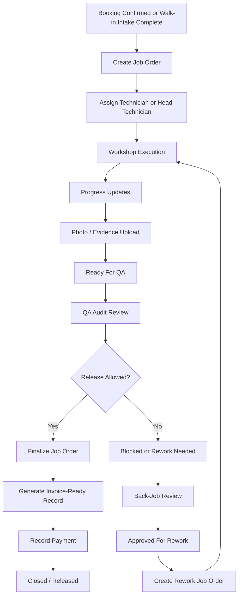

# Job Order Pipeline And Process Flow

## Purpose

This document condenses the current AUTOCARE job-order lifecycle into one Notion-ready reference so the team can redesign the `Job Orders` UI/UX around the real operational flow instead of the current page boundaries.

## Source Of Truth

- `D:\mainprojects\codewave\docs\architecture\domains\main-service\job-orders.md`
- `D:\mainprojects\codewave\docs\contracts\T516-job-order-workbench-web-flow.md`
- `D:\mainprojects\codewave\docs\contracts\T517-job-order-progress-photos-and-finalization-web-flow.md`
- `D:\mainprojects\codewave\docs\contracts\T518-quality-gates-review-release-and-override-web-flow.md`
- `D:\mainprojects\codewave\docs\contracts\T519-back-jobs-review-and-rework-web-flow.md`
- `D:\mainprojects\codewave\docs\team-flow-staff-admin-web-lifecycle.md`

## Plain-English Summary

The real job-order lifecycle is not only one screen. It is a multi-surface operational pipeline:

1. Booking or intake creates a workshop handoff.
2. A service adviser creates the job order.
3. Staff assign technicians.
4. Technician or head technician executes the work.
5. Staff collect progress and evidence.
6. The job order moves to QA.
7. QA either clears release, blocks release, or sends the work into rework.
8. Once cleared, the adviser or super admin finalizes the job order.
9. Payment is recorded against the finalized invoice-ready record.
10. If the customer comes back with an issue, the workflow moves into the back-job and rework loop.

The current UX feels confusing because these steps are spread across:

- `Booking Schedule`
- `Intake Inspection`
- `Job Orders`
- `QA Audit`
- `Back-Jobs`
- `Invoices & Orders`

The redesign target should be one clearer mental model across those pages.

## Operational Pipeline

## Core Stages

### 1. Intake And Handoff

**Entry point**

- confirmed booking
- or walk-in / front-desk intake

**Primary owner**

- `service_adviser`
- `super_admin`

**What must happen**

- identify customer and vehicle
- capture visit reason and concern
- confirm front-desk requirements
- prepare the job for workshop handoff

**Current surfaces**

- `Booking Schedule`
- `Intake Inspection`

**UX issue**

- handoff truth is split between booking state, intake capture, and job-order creation

### 2. Job Order Creation

**Primary owner**

- `service_adviser`
- `super_admin`

**What must happen**

- create one job order from:
  - a confirmed booking
  - or an approved back-job case
- snapshot the responsible service adviser
- define work items
- optionally assign technicians

**Current backend truth**

- one confirmed booking or approved back job creates one job order
- job orders store:
  - `job_type = normal | back_job`
  - `parent_job_order_id` for rework lineage

**Current surface**

- `Job Orders`

### 3. Assignment

**Primary owner**

- `service_adviser`
- `super_admin`

**Supporting users**

- `head_technician` can coordinate workshop work, but adviser/admin still own create/final assignment authority

**What must happen**

- choose one or more technicians
- confirm work is ready for workshop execution

**UX issue**

- assignment is mixed into the broader workbench instead of being a clearly separate decision step

### 4. Workshop Execution

**Primary owner**

- `technician`
- `head_technician`

**What must happen**

- open assigned work
- move the job through workshop statuses
- add progress notes
- upload evidence photos

**Allowed technician-oriented statuses**

- `in_progress`
- `blocked`
- `ready_for_qa`

**Current backend lifecycle**

- `draft -> assigned`
- `assigned -> in_progress`
- `in_progress -> blocked`
- `in_progress -> ready_for_qa`
- `blocked -> in_progress`
- `ready_for_qa -> in_progress` if more work is needed

### 5. QA Audit

**Primary owner**

- `head_technician`
- `super_admin`

**Readers**

- other staff with allowed QA visibility

**What must happen**

- read QA findings and risk score
- verify that the job order is release-ready
- either:
  - pass the release
  - keep it blocked
  - or apply a super-admin override when policy allows

**Important rule**

- QA status, not only job-order status, controls release readiness

**Current surface**

- `QA Audit`

**UX issue**

- staff often feel the flow is broken because the "why blocked" explanation lives on another page

### 6. Finalization

**Primary owner**

- `service_adviser`
- `super_admin`

**What must happen**

- finalize the job order only after readiness checks pass
- generate the invoice-ready record

**Important rule**

- finalization is not only a status change
- it is a dedicated action that creates invoice-ready finance data

### 7. Payment

**Primary owner**

- `service_adviser`
- `super_admin`

**What must happen**

- record settlement against the finalized invoice-ready record

**Important rule**

- payment happens after finalization
- payment does not replace QA

**Current surface**

- `Invoices & Orders`
- parts of `Job Orders`

### 8. Back-Job And Rework Loop

**Entry point**

- customer reports unresolved issue after earlier service

**Primary owner**

- `service_adviser`
- `super_admin`

**Review / release authority**

- `head_technician`
- `super_admin`

**What must happen**

- create back-job case
- inspect and validate the complaint
- approve for rework if evidence supports it
- create linked rework job order
- run the rework through workshop execution and QA again

**Current surface**

- `Back-Jobs`
- then back into `Job Orders`
- then `QA Audit`

## Roles By Stage

| Stage | Technician | Head Technician | Service Adviser | Super Admin |
| --- | --- | --- | --- | --- |
| Intake and handoff | no | limited | yes | yes |
| Create job order | no | no | yes | yes |
| Assign technicians | no | support | yes | yes |
| Workshop execution | yes | yes | view / support | yes |
| Progress notes | yes | yes | support | yes |
| Evidence upload | yes | yes | yes | yes |
| QA verdict | no | yes | read / support | yes |
| Finalize | no | no | yes | yes |
| Record payment | no | no | yes | yes |
| Back-job review | no | yes | yes | yes |

## System Status Model

### Job Order Statuses

- `draft`
- `assigned`
- `in_progress`
- `blocked`
- `ready_for_qa`
- `finalized`
- `cancelled`

### QA Release States

- `release_unavailable`
- `release_pending_audit`
- `release_blocked`
- `release_allowed`
- `release_allowed_by_override`

### Back-Job Statuses

- `reported`
- `inspected`
- `approved_for_rework`
- `in_progress`
- `resolved`
- `closed`
- `rejected`

## Real Blockers The UI Must Explain

These are the blockers that repeatedly confuse staff today:

1. The job order is not yet assigned.
2. The work is still `blocked` or missing required progress/evidence.
3. The job order is `ready_for_qa`, but the user is still working from the execution page instead of the QA page.
4. QA is blocking release because findings or inspection context are incomplete.
5. Finalization is unavailable because QA has not cleared release.
6. Payment is unavailable because there is no finalized invoice-ready record yet.
7. A back-job rework job order exists, but staff are looking at the wrong inspection or wrong lifecycle page.

## Current UX Pain Points

### Staff Mental Model Problem

Users think "Job Order" is one page, but the real process is:

- handoff
- execution
- QA
- finalization
- payment
- rework if needed

The UI should make that pipeline visible.

### Repeated Guessing Problem

Staff often do not know:

- what the next correct action is
- which role should do it
- which page owns it
- whether the job is blocked or simply waiting on another role

### Split-Surface Problem

The job-order lifecycle is operationally one story, but the UI splits it into multiple workspaces without a strong shared step model.

### Hidden Authority Problem

The person who can execute work is not always the person who can release or finalize work. The UI needs to show that clearly instead of treating all actions as equal buttons.

## Recommended UI/UX Direction

### Target Mental Model

The main redesign should feel like one operational pipeline with explicit handoffs:

1. `Queue`
2. `Overview`
3. `Assignments`
4. `Progress`
5. `Evidence`
6. `QA`
7. `Finalize`
8. `Payment`
9. `Rework` when applicable

### What The Main Workbench Should Always Show

- selected job order id
- customer and vehicle
- job type: normal or back-job rework
- current job-order status
- current QA release state
- current blocker
- next required action
- owner role of that next action

### What Should Change In The UX

- collapse the large queue once one job order is selected
- keep one sticky selected-record header
- show one workflow stepper instead of many duplicated summary cards
- highlight the single next action instead of leaving all controls equally prominent
- show when the user must leave execution and go to QA
- show when the user must leave QA and go to finalization/payment
- show the back-job loop as a separate branch, not as a surprise error state

## Notion-Friendly Pipeline Copy

Use this section directly if you want a clean paste into a Notion page:

### End-To-End Job Order Pipeline

1. Booking is confirmed or walk-in intake is completed.
2. Service adviser creates the job order and defines work items.
3. Technicians are assigned.
4. Technician or head technician performs the work.
5. Progress notes and evidence photos are recorded.
6. Job order is moved to `Ready for QA`.
7. QA Audit reviews release readiness.
8. If QA passes, the adviser or super admin finalizes the job order.
9. An invoice-ready record is created.
10. Payment is recorded.
11. If the customer later reports a problem, a back-job case is opened and, if validated, converted into a rework job order.

### UI/UX Goal

The redesign goal is to stop making staff guess which page comes next. The system should visibly guide the user through:

- what stage the job order is in
- what action is blocked
- who owns the next step
- when the workflow leaves execution and enters QA
- when the workflow leaves QA and enters finance/release

## Suggested Next Design Exercise

The next useful design step is to sketch one unified "Job Order Control Center" with:

- a compact queue strip
- a sticky job-order header
- a central stepper
- one active work panel at a time
- explicit role-aware next actions
- a visible QA handoff step
- a visible rework branch when the source type is `back_job`
