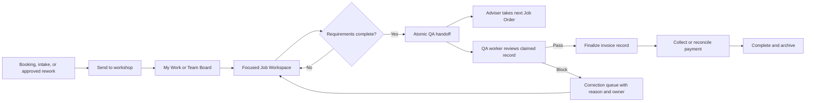

# Target Workflow and UX Specification

This target preserves existing public routes, status values, and deployment boundaries while correcting the current operational risks.

## Proposed Workflow

## Operating Principles

- The queue and current work are separate surfaces.
- Queue rows are bounded, searchable, filterable, and safe under concurrent change.
- A workspace renders one record and one current stage.
- Every stage exposes one primary next action, responsible role, blocker, and destination.
- Slow QA releases the sender to other work.
- A record reference shown in the action form must match the active claim.
- History is read-only.
- Visual polish follows correctness, contracts, and tests.

## My Work Specification

Purpose: help each adviser remember and resume current responsibilities.

Content:

- active Job Order claim;
- active QA claim;
- work assigned to the user but not actively claimed;
- returned corrections;
- overdue/blocked work;
- unread assignment and blocker notifications.

Actions:

- Resume;
- Release with reason;
- Pause accepting work;
- Take next for each queue;
- Open full workspace.

Rules:

- Show Job Order and QA claims independently.
- Display lease health and last heartbeat.
- Warn when the user takes both queue types.
- Never silently replace the visible workspace while it has an unsaved draft.

## Team Board Specification

Default presentation: dense table/inbox, 25 records.

Columns:

- reference;
- customer and vehicle;
- stage;
- technician profile;
- staff owner;
- scheduled date;
- priority/risk;
- waiting time;
- blocker;
- next action.

Views:

- My Work
- Team Queue
- Unassigned
- Blocked
- History

Filters:

- stage;
- owner;
- technician;
- specialty;
- scheduled date;
- priority;
- job type;
- blocker;
- overdue;
- text search.

Interaction:

- Selecting a row opens a right-side read-only preview.
- `Open workspace` navigates to `/admin/job-orders/[id]`.
- `Take this job` performs an atomic selected-record claim.
- `Take next` performs priority dispatch.
- Admin assignment/reassignment requires a reason.

History:

- read-only;
- no active claim buttons;
- no active workflow header;
- no sticky control center;
- supports filters and timeline navigation.

## Job Workspace Specification

Route: `/admin/job-orders/[id]`

### Header

- compact and non-sticky;
- reference, status, job type/rework label;
- customer and vehicle summary;
- ownership/claim state;
- Back to board;
- optional context drawer.

### Stage rail

Desktop:

- compact horizontal rail with current, complete, blocked, and unavailable states.

Mobile/responsive:

- horizontally scrollable tabs or compact step selector;
- no fixed-height oversized panel.

### Stage body

Render only the current stage:

- Workshop setup
- Assignments
- Work progress
- Evidence
- QA handoff/status
- Finalize
- Payment

### Progress

Organize by service item:

- completion checklist;
- assigned technician profile and specialty;
- latest progress update;
- blocker;
- required evidence and attachment status;
- status history.

### Action footer

- stable within normal layout or viewport-safe sticky region;
- never covers form content;
- one primary action;
- secondary actions in a menu;
- action text names the outcome, such as `Send to QA`;
- unsaved-draft warning;
- mutation state includes operation and record reference.

### Context drawer

Optional:

- customer;
- vehicle;
- intake notes;
- source booking/back-job;
- activity timeline;
- audit history;
- invoice/payment link.

## QA Workspace Specification

Route: `/admin/qa-audit`

### Queue shell

- same bounded table/inbox model;
- total, mine, unassigned, blocked, overdue counts;
- Start accepting work, Take next, Pause;
- active claim/resume strip;
- search and risk/wait/stage filters.

### Review workspace

- immutable header with selected reference, customer/vehicle, active claim owner, lease, and gate version;
- service-by-service evidence list;
- findings grouped by severity and provenance;
- required evidence preview;
- intake/workshop discrepancy summary;
- review note;
- Pass and Block actions;
- no action until loaded gate ID, route/selection ID, and claim entity ID match.

### Completion

After Pass:

- show confirmation for the completed reference;
- replace detail with a loading/skeleton state for next work;
- load the next gate from the completion response or a fresh keyed request;
- never render the old verdict under the new row.

After Block:

- show correction destination and owner/unassigned state;
- preserve reason in the operational timeline;
- offer `Take next QA`;
- Job Order returns to correction work.

## Error and Conflict States

| Condition | Required UI |
| --- | --- |
| `WORK_CLAIM_CONFLICT` | Name current handler when authorized, refresh row, offer Take next. |
| `ACTIVE_WORK_EXISTS` | Show existing claim and Resume/Release actions. |
| `WORK_CLAIM_REQUIRED` | Disable mutation, refresh claim, return to queue if lost. |
| `STALE_WORK_VERSION` | Preserve draft, reload current version, show changed fields/decision. |
| Offline | Preserve draft locally, disable unsafe mutation, retry on reconnect. |
| Server unavailable | Operation-specific message, correlation ID, safe retry guidance. |
| Validation failure | Inline field/service errors with focus management. |
| Partial artifact failure | Confirm durable finalization; show invoice PDF generation as retrying/failed separately. |
| Empty queue | Explain no current work; retain accepting/paused state. |
| Lease near expiry | Renew visibly or warn before destructive action. |

## API Contract Changes

### Queue list

Add:

- keyset cursor version and sort tuple;
- stage, owner, technician, date, priority, job type, blocker, overdue, and sort filters;
- counts for mine/unassigned/blocked/overdue;
- full current claims for both queue types;
- lease expiry and heartbeat state.

### Claim-protected mutations

- require `x-work-claim-id`;
- reject missing/mismatched/expired claims;
- remove optional guard dependency;
- preserve stable conflict codes.

### QA verdict

- require `If-Match`;
- require pending reviewer state;
- return completed gate, completed claim, and optional next claim in one authoritative response;
- use a distinct audited operation for corrections.

### Finalization

- accept an idempotency key;
- transactionally transition state and invoice;
- return artifact state separately;
- publish through an outbox.

## Database Recommendations

- Add indexes supporting the chosen keyset sort and common queue filters.
- Add a durable append-only operational event table or outbox-backed audit projection.
- Add explicit invoice artifact state and retry metadata.
- Preserve current active-claim partial unique indexes.
- Store verdict history as immutable events or revisions.
- Commit each schema change as an incremental Drizzle migration.
- Validate migrations against empty and current-schema databases.

## Component Boundaries

### Staff web

- `JobOrdersBoard`
- `QueueFilterBar`
- `QueueTable`
- `QueuePreviewDrawer`
- `JobWorkspaceShell`
- one Job Order stage component per stage
- `JobOrderDraftProvider`
- `JobOrderActionFooter`
- `JobOrderContextDrawer`
- `QaQueueShell`
- `QaReviewController`
- `QaEvidenceReview`
- `QaVerdictForm`
- `ClaimStatus`

### Backend

- Job Order lifecycle service
- assignment service
- progress/evidence service
- QA handoff service
- finalization service
- queue dispatch policy
- claim lease service
- quality decision service
- audit/outbox service

## Manual Usability Scenarios

1. New adviser finds and starts the next unassigned Job Order without instruction.
2. Adviser resumes work after refresh and can identify every active responsibility.
3. Adviser sends a completed Job Order to QA and immediately takes new work.
4. Three QA staff start accepting work and visibly receive different records.
5. QA staff passes a record and confirms the next row/detail reference match.
6. QA staff blocks a record and adviser finds the correction reason and required service.
7. Admin reassigns an abandoned claim with a reason.
8. Browser closes and another user recovers the record after lease expiry.
9. Network disconnects with an unsaved progress note and the draft remains recoverable.
10. Staff filters 500+ records by stage, owner, technician, blocker, and date.
11. Staff opens History and sees no actionable workflow controls.
12. Keyboard-only user claims, reviews, and returns to the queue.

Success measure:

- target users complete each core scenario without developer explanation;
- no participant submits a decision against the wrong reference;
- ownership and next action are correctly understood at each handoff;
- task time and misclick/backtrack count improve from baseline.

## Rollout and Migration

1. Add telemetry and characterization tests.
2. Fix keyed QA detail state behind a frontend flag.
3. Require version matching while logging old clients that omit it.
4. Update clients, then make claim/version headers mandatory.
5. Introduce transaction/outbox migration for finalization.
6. Add keyset API alongside the old cursor, migrate UI, then retire offset decoding.
7. Extract components/services without changing routes.
8. Run desktop/tablet/mobile-responsive usability and accessibility checks.
9. Apply final visual polish.
