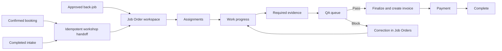
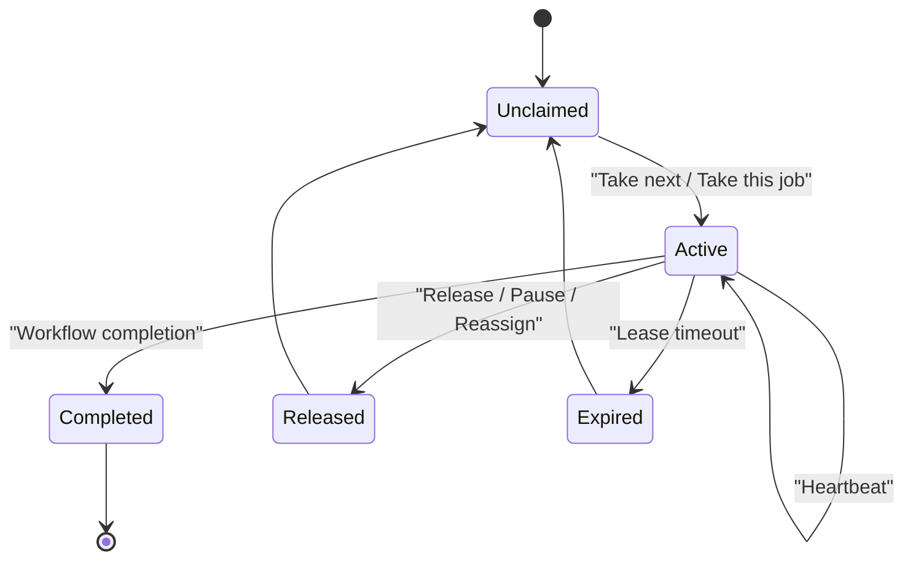

# Workflow and Operating Rules

This file describes current behavior found in code and verified against the running local application.

## End-to-End Lifecycle

## Job Order Status Transitions

| Current | Allowed next |
| --- | --- |
| `draft` | `assigned`, `cancelled` |
| `assigned` | `in_progress`, `cancelled` |
| `in_progress` | `blocked`, `ready_for_qa`, `cancelled` |
| `blocked` | `in_progress`, `cancelled` |
| `ready_for_qa` | `in_progress`, `cancelled` |
| `finalized` | terminal |
| `cancelled` | terminal |

Assignments are required before entering or remaining in assigned, in-progress, blocked, and ready-for-QA work.

## Current Workspace Stages

The focused workspace presents these operational stages:

1. Workshop setup
2. Assignments
3. Work progress
4. Evidence
5. QA
6. Finalize
7. Payment

The visible stage is derived from persisted Job Order state, service completion, evidence, QA gate state, and invoice/payment state. The route remains `/admin/job-orders/[id]`.

## Booking and Intake Handoff

`POST /api/job-orders/booking-handoffs/{bookingId}` is idempotent:

- If no Job Order exists for the source, it creates one and returns `created: true`.
- If one already exists, it returns the existing identifier/reference and `created: false`.
- If concurrent requests race on the unique source constraint, the service re-reads and returns the winning record.

The intended UI behavior is one `Send to Workshop` action followed by navigation to the existing or created workspace.

## Service Completion and Evidence

A Job Order cannot be sent to QA until:

- assignments exist;
- every required service item is complete;
- a saved progress update exists;
- every service item that requires photo evidence has linked evidence.

Progress logs can reference:

- a work item;
- a technician profile;
- the staff recorder;
- the workshop stage;
- completed item IDs;
- linked photo IDs.

Technicians are profiles for assignment, specialty, checklists, and accountability. They are not authenticated staff-web users in the canonical role model.

## QA Eligibility

The queue selection query requires:

- Job Order status `ready_for_qa`;
- reviewer verdict `pending`;
- quality precheck `completed` or `unavailable`.

Sending a Job Order to QA begins or resumes the quality gate and completes the active Job Order queue claim.

## QA Verdicts

### Pass

- Gate becomes passed.
- Job Order remains eligible for finalization.
- Current QA claim is completed.
- If the staff queue session is accepting work, the server can dispatch the next eligible QA record.

### Block

- Gate becomes blocked.
- Job Order transitions from `ready_for_qa` to `in_progress`.
- The block reason is persisted.
- Current QA claim is completed.
- The record returns to the Job Order operating surface for correction.

The current implementation does not create a strict routing guarantee back to the exact previous claim owner. Ownership/adviser metadata and queue selection guide visibility, but another eligible adviser or a super admin can take the correction.

### Override

- Super admin only.
- Gate must be blocked.
- Reason length is 8 to 1,000 characters.
- Override is recorded separately and an event is emitted.

### Current concurrency weakness

`If-Match` can be omitted from verdict requests. When supplied, a stale version produces `STALE_WORK_VERSION`. When omitted, the repository does not enforce the expected version. There is also no terminal-state guard preventing an authorized direct request from replacing an earlier decision.

## Finalization and Payment

Finalization requires:

- Job Order status `ready_for_qa`;
- all Job Order items complete;
- quality gate passed or overridden;
- authenticated role service adviser or super admin;
- a service adviser may finalize only an owned Job Order.

Finalization creates an invoice record with pending payment. Payment is a later operation through the record-payment or PayMongo flow.

The current repository writes the invoice and Job Order status separately rather than inside one database transaction. This is a documented reliability gap.

## Back-Job Rework

Approved back-job work uses the same Job Order workspace and normal stage progression. The Job Order stores:

- job type;
- parent/source lineage;
- notes and timestamps.

The UI should retain a visible rework label and source link so staff do not mistake a correction for a new customer request.

## Staff Role Matrix

| Capability | Service adviser | Super admin | Customer | Technician profile |
| --- | ---: | ---: | ---: | ---: |
| Sign in to staff web | Yes | Yes | No | No |
| View Job Order board | Yes | Yes | No | No |
| Claim Job Order work | Yes | Yes | No | No |
| Claim QA work | Yes | Yes | No | No |
| Record QA verdict | Yes | Yes | No | No |
| Override blocked QA | No | Yes | No | No |
| Reassign staff queue work | No | Yes | No | No |
| Use customer mobile app | No | No | Yes | No |
| Be assigned to service items | N/A | N/A | No | Yes |

Retired technician/head-technician authentication references should be removed from generated text and mobile tests.

## Queue Views

Both operational queues expose:

- My Work
- Team Queue
- Unassigned
- Blocked
- History

History is read-only. It must not mount active workflow controls or a sticky active-work header.

## Claim and Lease Lifecycle

### Server rules

- Atomic next-work dispatch is supported.
- Atomic selected-record claim is supported.
- A partial unique index prevents two active claims for the same queue/entity.
- A partial unique index prevents one user holding two active claims in the same queue.
- A user can hold one Job Order claim and one QA claim simultaneously.
- Lease length is 15 minutes.
- Completing a claim can auto-dispatch the next record when the owner/session context is supplied.

### Browser behavior

- Heartbeat interval: 60 seconds.
- Heartbeat runs while the document is visible.
- Queue reload interval: 10 seconds.
- Team presence reload interval: 15 seconds.
- A staff session is considered recently present for about 90 seconds.
- Pausing stops acceptance and releases current work when that action is chosen.
- Closing the tab does not send a reliable release request; the claim remains until lease expiry.
- During a network disconnect, missed heartbeats eventually allow lease expiry. On reconnect the queue refreshes.

### Conflict codes

- `ACTIVE_WORK_EXISTS`
- `WORK_NOT_ELIGIBLE`
- `WORK_CLAIM_CONFLICT`
- `WORK_CLAIM_REQUIRED`
- `WORK_CLAIM_CONTEXT_MISSING`
- `STALE_WORK_VERSION`

These codes should remain stable client-facing conflict signals.

## Claim Enforcement Gap

The intended model is claim-required mutation. Two compatibility paths currently fail open:

1. If no active claim exists and no `x-work-claim-id` header is supplied, repository access validation can return `null` rather than reject.
2. If the queue service is absent from the guard because of dependency/module misconfiguration, the guard allows the request.

Planning should treat removal of these paths as a prerequisite for trusting workload ownership.

## Unsaved Work

The Job Order workspace warns on browser navigation when a draft is dirty. Drafts are retained in component state while the workspace remains mounted.

The current implementation does not provide a durable server-side draft or cross-device resume model. A full refresh, expired session, browser crash, or another workstation can lose unsaved form input.

## Queue Pagination and Filtering

Current behavior:

- 25 rows per request in the staff web.
- Server-side view and search.
- Opaque cursor in the HTTP contract.
- The backend decodes the cursor as an offset.
- Aggregate counts are returned without rendering every record.

Missing from the planned contract:

- stable keyset cursor;
- stage filter;
- owner filter;
- technician filter;
- scheduled-date filter;
- priority filter;
- blocker filter;
- explicit sort control.

The current implementation prevents a 500-row DOM, but offset pagination can duplicate or skip records while the live queue changes.

## Operational Answers

### Can three QA staff receive different work?

Yes. Atomic claims plus the unique active-entity index prevent the same QA record from being actively claimed twice. The unique owner/queue index limits each person to one QA claim.

### Can one adviser keep a Job Order while QA takes time?

Sending to QA completes the Job Order queue claim. The adviser can take another Job Order while a QA staff member handles the submitted record.

### Can one adviser hold Job Order and QA work?

Yes. Uniqueness is per queue type, so one active claim in each queue is allowed. The interface should make both responsibilities visible to avoid accidental multitasking overload.

### What happens after tab close?

No guaranteed immediate release. The lease remains active until its 15-minute expiry unless another process explicitly releases or reassigns it.

### What happens after a blocked QA verdict?

The Job Order returns to `in_progress` with the reason and leaves the QA queue. It becomes correction work in Job Orders and must later satisfy evidence/completion requirements before another QA handoff.

### Can a passed verdict be changed?

The current direct API implementation can overwrite it under some conditions. The intended future behavior should make verdicts append-only or require an explicit audited correction/override operation.

### Does finalization charge the customer?

No. It creates the invoice-ready record. Payment remains a separate step.
