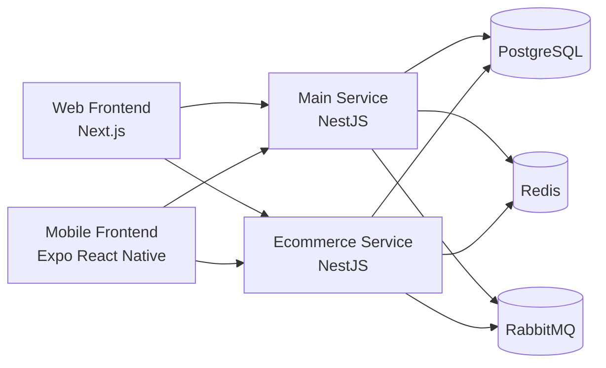

# AUTOCARE System Architecture, External APIs, and Backend Report

Date: 2026-04-17  
Status: Current implementation snapshot based on repo code and canonical architecture docs

## Purpose

This document consolidates the current AUTOCARE system architecture, the backend structure, and the external APIs or third-party services that the system uses today. It is intended for project-management, documentation, and coordination purposes.

## Executive Summary

AUTOCARE currently uses a service-oriented backend with two NestJS services:

- `main-service` for operational automotive workflows
- `ecommerce-service` for parts, cart, orders, and invoice-payment tracking

The system uses:

- `Next.js` web frontend
- `Expo React Native` mobile frontend
- `NestJS` backend services
- `Drizzle ORM` for typed persistence
- `PostgreSQL` as the main transactional database
- `Redis + BullMQ` for jobs, reminders, retries, and background processing
- `RabbitMQ` for service-to-service and cross-domain asynchronous events
- `Swagger / OpenAPI` as the machine-readable contract for implemented internal backend endpoints

The current backend is already organized by domain modules, and the system presently relies on a small set of external integrations: Google identity verification, SMTP email delivery, PostgreSQL, Redis/BullMQ, and RabbitMQ.

## Updated System Architecture

### High-Level Architecture

### Frontend Layer

The current system has two frontend clients:

- `frontend/`
  - `Next.js 15`
  - primary web client for customer-facing and admin-facing UI
- `mobile/`
  - `Expo SDK 54`
  - React Native mobile client for phone-based usage

Both frontends are designed to consume backend REST APIs through `/api/...` endpoints and align against Swagger plus the shared contract-pack workflow documented in the architecture docs.

### Backend Layer

The backend is split into two services:

#### 1. `main-service`

Primary operational business service for:

- authentication and user identity
- vehicles
- bookings
- inspections
- job orders
- back jobs
- quality gates
- vehicle lifecycle
- insurance
- notifications
- loyalty
- chatbot
- analytics

#### 2. `ecommerce-service`

Commerce-focused service for:

- catalog
- cart
- orders
- invoice payments
- inventory module foundation

### Shared Infrastructure

The current infrastructure declared in `backend/docker-compose.yml` includes:

- `PostgreSQL 16`
  - container: `postgre_db`
  - host port: `5433`
- `Redis 7`
  - container: `autocare_redis`
  - host port: `6379`
- `RabbitMQ 3`
  - container: `autocare_rabbitmq`
  - host ports: `5672` and `15672`

### API Contract Strategy

The current API strategy is:

- `REST + JSON` for synchronous APIs
- `Swagger / OpenAPI`
  - human-readable docs at `/docs`
  - machine-readable docs at `/docs-json`
- `RabbitMQ`
  - for cross-service or cross-domain facts/events
- `BullMQ + Redis`
  - for retries, reminders, analytics refresh, OTP delivery, and internal jobs

## Backend Architecture

### Main-Service Modules

The current `main-service` app module imports:

- `UsersModule`
- `AuthModule`
- `VehiclesModule`
- `BookingsModule`
- `ChatbotModule`
- `BackJobsModule`
- `InsuranceModule`
- `NotificationsModule`
- `LoyaltyModule`
- `JobOrdersModule`
- `QualityGatesModule`
- `InspectionsModule`
- `VehicleLifecycleModule`
- `AnalyticsModule`
- `AiWorkerModule`

Shared modules used by `main-service`:

- `ConfigModule`
- `DatabaseModule`
- `QueueModule`
- `EventsModule`

### Ecommerce-Service Modules

The current `ecommerce-service` app module imports:

- `CatalogModule`
- `InventoryModule`
- `CartModule`
- `OrdersModule`
- `InvoicePaymentsModule`

Shared modules used by `ecommerce-service`:

- `ConfigModule`
- `DatabaseModule`
- `QueueModule`
- `EventsModule`

### Backend Technical Standards

The backend follows these implementation conventions:

- `ValidationPipe` with:
  - `whitelist: true`
  - `forbidNonWhitelisted: true`
  - `transform: true`
- global REST prefix:
  - `/api`
- CORS enabled for configured frontend origins
- DTO-first request validation
- Swagger setup in both services

### Health Endpoints

Implemented health checks:

- `GET /api/health` on `main-service`
- `GET /api/health` on `ecommerce-service`

Default service ports:

- `main-service`: `3000`
- `ecommerce-service`: `3001`

## External APIs and Third-Party Services Used by the System

This section lists only the outside services or external APIs that the current system uses. It does not list AUTOCARE's own internal `/api/...` routes.

### 1. Google Identity Verification API

Current usage:

- used by `main-service.auth`
- implemented through `google-auth-library`
- verifies Google ID tokens during:
  - customer Google signup flow
  - staff Google activation flow

Current implementation details:

- service: `GoogleIdentityService`
- code path:
  - `backend/apps/main-service/src/modules/auth/services/google-identity.service.ts`
- environment dependency:
  - `GOOGLE_CLIENT_ID`

Purpose in the system:

- validate Google-issued identity tokens
- confirm verified Google email ownership
- extract Google user identity fields needed for account activation

### 2. SMTP Email Provider API

Current usage:

- used by `main-service.notifications`
- implemented through `nodemailer`
- default configuration targets SMTP mail delivery
- current default host in config is:
  - `smtp.gmail.com`

Current implementation details:

- service: `SmtpMailService`
- code path:
  - `backend/apps/main-service/src/modules/notifications/services/smtp-mail.service.ts`
- environment dependencies:
  - `SMTP_HOST`
  - `SMTP_PORT`
  - `SMTP_SECURE`
  - `SMTP_USER`
  - `SMTP_PASS`
  - `SMTP_FROM`

Purpose in the system:

- send email OTP messages for account verification and activation
- support system email delivery for notification workflows

### 3. PostgreSQL Database

Current usage:

- main transactional system of record
- accessed through `Drizzle ORM`
- used by both `main-service` and `ecommerce-service`

Current implementation details:

- Docker image: `postgres:16`
- container name: `postgre_db`
- host port: `5433`
- environment dependency:
  - `DATABASE_URL`

Purpose in the system:

- store users, vehicles, bookings, job orders, insurance records, loyalty data, ecommerce orders, invoices, and related transactional records

### 4. Redis

Current usage:

- queue and background-job backing service
- used with `BullMQ`

Current implementation details:

- Docker image: `redis:7-alpine`
- container name: `autocare_redis`
- host port: `6379`
- environment dependencies:
  - `REDIS_HOST`
  - `REDIS_PORT`

Purpose in the system:

- run delayed jobs
- support retries
- power reminders, OTP delivery jobs, analytics jobs, lifecycle jobs, and quality-gate jobs

### 5. RabbitMQ

Current usage:

- event broker for asynchronous system integration
- shared by backend services for event-based communication

Current implementation details:

- Docker image: `rabbitmq:3-management`
- container name: `autocare_rabbitmq`
- host ports:
  - `5672`
  - `15672`
- environment dependencies:
  - `RABBITMQ_URL`
  - `RABBITMQ_QUEUE`

Purpose in the system:

- publish and consume domain events
- support decoupled service and domain integration

### 6. AI Provider APIs

Current status:

- approved in architecture as Phase 2 through a provider adapter
- not currently wired to a specific live third-party AI provider in the code that was reviewed for this report

Purpose in future architecture:

- lifecycle-summary generation
- quality-gate AI assistance

Important note:

- AI provider integration is planned and governed by architecture policy, but it should not be reported as a current live external dependency unless a provider is actually configured and implemented in code

### Not Currently Used as Live External APIs

The current docs and code indicate these are not live external API integrations at this stage:

- insurer APIs
- payment gateway APIs
- SMS gateway APIs
- hardware or IoT device APIs

## Async and Integration Patterns

### RabbitMQ Event Usage

The canonical event model includes facts such as:

- `booking.created`
- `booking.confirmed`
- `inspection.completed`
- `vehicle.timeline_refresh_requested`
- `back_job.opened`
- `back_job.resolved`
- `job_order.created`
- `job_order.finalized`
- `quality_gate.audit_requested`
- `quality_gate.blocked`
- `quality_gate.overridden`
- `service.invoice_finalized`
- `service.payment_recorded`
- `order.created`
- `order.invoice_issued`
- `invoice.payment_recorded`
- `loyalty.points_earned`

### BullMQ Job Usage

Current architecture expects BullMQ jobs for:

- booking reminders
- inspection follow-up reminders
- auth OTP delivery retries
- notification retries
- vehicle timeline refresh/rebuild
- AI lifecycle summary generation
- quality-gate audit execution
- analytics aggregation

## Current Implementation Notes

- `main-service` is currently the broadest and most mature backend service.
- `ecommerce-service` already contains working commerce modules for catalog, cart, orders, and invoice-payment tracking.
- `inventory` is structurally present but still foundation-level from an implementation perspective.
- The frontend/backend coordination model is contract-first:
  - architecture docs define intent
  - task docs define slice delivery
  - Swagger defines live internal backend contract
- for PM reporting, external dependency reporting should focus on Google identity verification, SMTP mail delivery, PostgreSQL, Redis, and RabbitMQ rather than the internal `/api` route list

## Recommended Reference Files

For future documentation updates, the strongest source files are:

- [architecture/system-architecture.md](./architecture/system-architecture.md)
- [architecture/api-strategy.md](./architecture/api-strategy.md)
- [architecture/domain-map.md](./architecture/domain-map.md)
- `backend/apps/main-service/src/app.module.ts`
- `backend/apps/ecommerce-service/src/app.module.ts`
- controller files under:
  - `backend/apps/main-service/src/modules/*/controllers`
  - `backend/apps/ecommerce-service/src/modules/*/controllers`

## Conclusion

AUTOCARE currently has a modular multi-service backend with a clear separation between operational service workflows and e-commerce workflows. The system already exposes a substantial REST API surface through NestJS controllers, supports contract documentation through Swagger, and uses PostgreSQL, Redis/BullMQ, and RabbitMQ as the supporting infrastructure backbone.

For documentation and PM reporting purposes, this file can serve as the current consolidated architecture + external API + backend status report.
