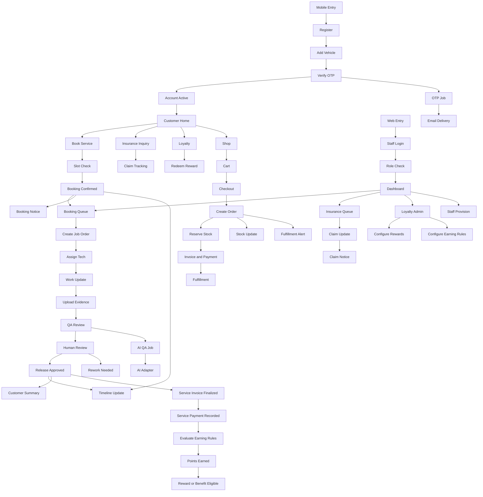
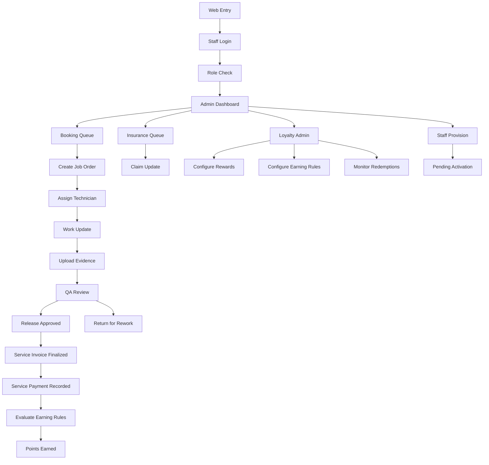

# AUTOCARE Combined Mermaid Pack

Date: 2026-04-18  
Purpose: Three Mermaid-safe diagrams: a unified flow, a dedicated admin flow, and a required-data map, updated for service-payment-only loyalty.

## 1. Combined System Flow

## 2. Required Data by Major Node

```mermaid
flowchart LR
  N1[Register] --> N1A[UI: name, email, phone, password]
  N1 --> N1B[System: unique email check, risk check]

  N2[Add Vehicle] --> N2A[UI: plate, make, model, year]
  N2 --> N2B[System: customer onboarding context]

  N3[Verify OTP] --> N3A[UI: OTP code]
  N3 --> N3B[System: pending account id, otp challenge]
  N3 --> N3C[External: email delivery already completed]

  N4[Book Service] --> N4A[UI: service type, date, time, vehicle]
  N4 --> N4B[System: active customer session, owned vehicle]
  N4 --> N4C[System: slot inventory]

  N5[Insurance Inquiry] --> N5A[UI: inquiry details, attachments]
  N5 --> N5B[System: customer id, vehicle id, owner autofill]

  N6[Redeem Reward] --> N6A[UI: reward choice]
  N6 --> N6B[System: loyalty account, points balance]

  N7[Checkout] --> N7A[UI: cart items, quantity, checkout action]
  N7 --> N7B[System: product snapshot, stock state]
  N7 --> N7C[System: active customer session]

  N8[Create Job Order] --> N8A[UI: adviser decision, technician assignment]
  N8 --> N8B[System: confirmed booking id, adviser id]

  N9[QA Review] --> N9A[UI: diagnosis notes, evidence, reviewer decision]
  N9 --> N9B[System: job order id, QA state]
  N9 --> N9C[External: AI analysis if enabled]

  N10[Claim Update] --> N10A[UI: new claim status, optional note]
  N10 --> N10B[System: inquiry or claim id]

  N11[Staff Provision] --> N11A[UI: staff email, role, staff code]
  N11 --> N11B[System: super admin session, pending activation state]

  N12[Service Payment Recorded] --> N12A[UI: payment entry, paid amount, cashier or adviser action]
  N12 --> N12B[System: finalized invoice record, customer id, vehicle id]
  N12 --> N12C[System: active earning rules, qualifying service metadata]

  N13[Configure Earning Rules] --> N13A[UI: rule name, formula, thresholds, filters]
  N13 --> N13B[System: super admin session, audit trail]

  N14[Configure Rewards] --> N14A[UI: reward name, points cost, benefit description, fulfillment note]
  N14 --> N14B[System: super admin session, reward catalog audit trail]
```

## 3. Admin / Staff Flow

## Usage Note

- Use the first diagram when you want a single merged flow for presentation or overview.
- Use the second diagram when you want to explain what data each major node depends on.
- Use the third diagram when you need a standalone admin/staff Mermaid flow.
- Loyalty is earned only from successful paid service work, not from ecommerce checkout.
- If your Mermaid renderer is strict, test this file first before using the more detailed engineering documentation.
