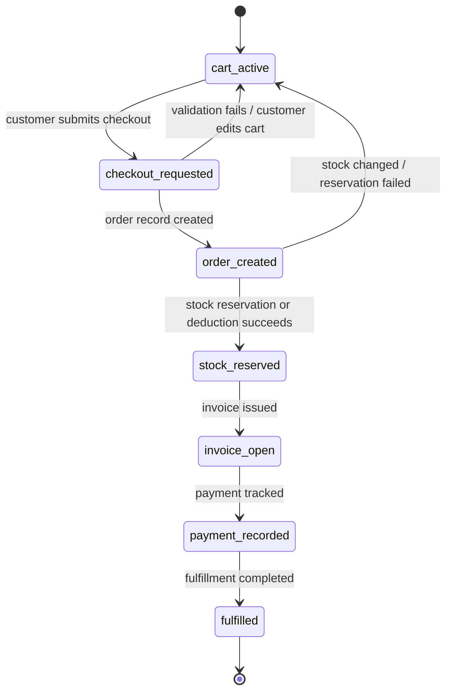

# AUTOCARE Commerce State Machine

Date: 2026-04-18  
Purpose: Authoritative record-state reference for cart, checkout, order, stock, invoice, payment, and fulfillment without implying ecommerce-earned loyalty

## Commerce State Diagram

## State Rules

- `cart_active` is customer-editable and not yet committed.
- `checkout_requested` is validation-in-progress, not a successful order.
- `order_created` means the commercial record exists even if stock or payment is still incomplete.
- `stock_reserved` is preferred over a weak check-then-deduct model.
- `invoice_open` and `payment_recorded` are separate states because invoice tracking is part of the architecture.
- ecommerce payment tracking must stay decoupled from workshop/service loyalty earning.

## Flow Contract Appendix

| Record / Transition | Actor | Owning Domain / Service | Required Inputs | Output / State Change | Transport | RBAC Gate |
| --- | --- | --- | --- | --- | --- | --- |
| Cart updates | `customer` | `ecommerce.cart` | product, quantity, cart action | `cart_active` updated | sync API | active customer |
| Checkout request | `customer` | `ecommerce.orders` | valid cart, checkout request | `checkout_requested` | sync API | active customer |
| Order creation | system | `ecommerce.orders` | validated checkout, product snapshot | `order_created` | sync API / service write | active customer context |
| Stock reservation or deduction | system | `ecommerce.inventory` | order reference, item quantities | `stock_reserved` or rollback to cart retry path | sync API / internal service action | none |
| Invoice issuance | system | `ecommerce.invoice-payments` | created order | `invoice_open` | sync API / internal service action | none |
| Payment tracking | system or staff | `ecommerce.invoice-payments` | invoice reference, payment entry | `payment_recorded` | sync API | staff/admin or controlled payment recorder |
| Fulfillment completion | staff/system | `ecommerce.orders`, `ecommerce.inventory` | paid/approved order, fulfillment action | `fulfilled` | sync API + events | staff/admin |
