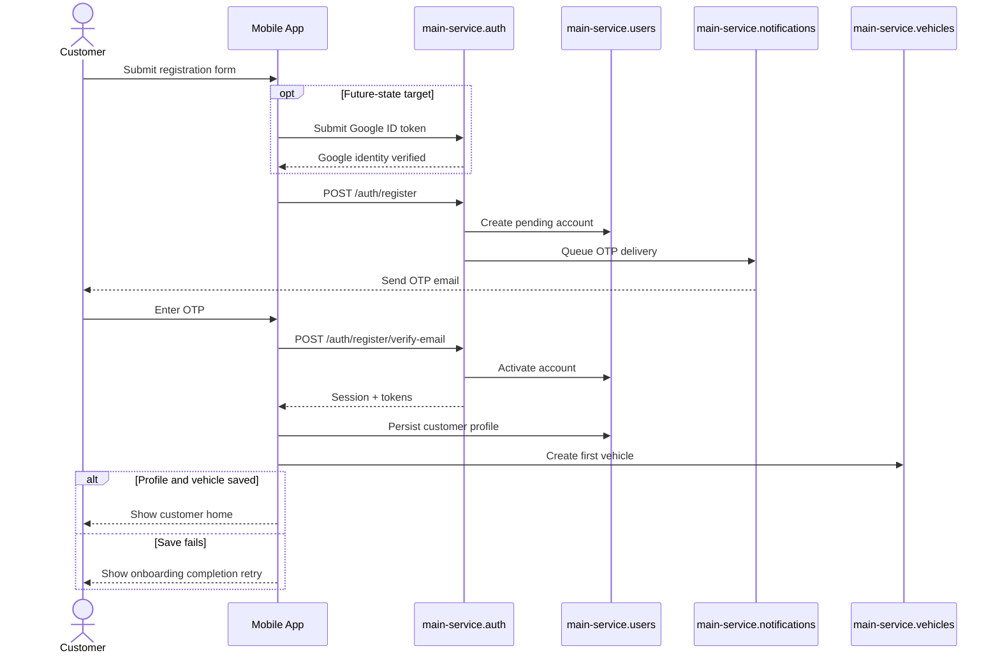

# AUTOCARE Customer Mobile Lifecycle

Date: 2026-04-18  
Purpose: Customer-facing mobile lifecycle reference, including identity activation and primary customer journeys

## Identity and Activation Sequence

This sequence is the most important correction to the original team flow. It separates registration, pending activation, OTP verification, token issuance, and post-activation onboarding persistence.

## Customer Journey Flow

```mermaid
flowchart LR
  APP[Mobile App Entry] --> REG[Start Registration]
  REG --> IDENTITY[Capture Identity and Contact Info]
  IDENTITY --> VEHFORM[Capture Vehicle Details]
  VEHFORM --> CREATEPENDING[Create Pending Account]
  CREATEPENDING --> SENDOTP[Send Email OTP]
  SENDOTP --> OTP[Enter OTP]
  OTP --> OTPCHECK{OTP Valid?}

  OTPCHECK -- No --> OTPFAIL[Show OTP Error / Retry / Resend]
  OTPFAIL --> OTP

  OTPCHECK -- Yes --> ACTIVATE[Activate Account and Issue Session]
  ACTIVATE --> SAVEONBOARD[Persist Customer Profile and First Vehicle]
  SAVEONBOARD --> SAVEOK{Save Successful?}

  SAVEOK -- No --> RETRYONBOARD[Retry Onboarding Completion]
  RETRYONBOARD --> SAVEONBOARD

  SAVEOK -- Yes --> HOME[Customer Home]

  HOME --> BOOKSTART[Start Booking]
  BOOKSTART --> SERVICE[Select Service Type]
  SERVICE --> SLOTQ[Query Available Slots]
  SLOTQ --> PICKSLOT[Choose Date and Time]
  PICKSLOT --> HOLD[Attempt Slot Hold]
  HOLD --> SLOTOK{Slot Still Available?}
  SLOTOK -- No --> ALT[Show Alternate Slots / Retry]
  ALT --> SLOTQ
  SLOTOK -- Yes --> CREATEBOOK[Create Booking]
  CREATEBOOK --> BOOKCONF[Booking Confirmed]

  HOME --> INSSTART[Start Insurance Inquiry]
  INSSTART --> AUTOFILL[Auto-Fill Vehicle and Owner]
  AUTOFILL --> INSFORM[Submit Inquiry Form]
  INSFORM --> CLAIMVIEW[Track Claim Status]

  HOME --> LOYALTY[View Loyalty Dashboard]
  LOYALTY --> BAL[View Points Balance]
  BAL --> REDEEM[Choose Reward / Redeem]
  REDEEM --> ENOUGH{Points Sufficient?}
  ENOUGH -- No --> NOPOINTS[Show Insufficient Points]
  ENOUGH -- Yes --> APPLY[Apply Reward to Valid Transaction]
  APPLY --> REDEEMOK[Redemption Recorded]

  HOME --> SHOP[Browse Ecommerce]
  SHOP --> CATALOG[Browse Catalog]
  CATALOG --> CART[Manage Cart]
  CART --> CHECKOUT[Checkout]
  CHECKOUT --> ORDEROK[Order Created]

  HOME --> TIMELINE[View Timeline]
```

## Flow Contract Appendix

| Segment | Actor | Owning Domain / Service | Required Inputs | Output / State Change | Transport | RBAC Gate |
| --- | --- | --- | --- | --- | --- | --- |
| Registration request | `customer` | `main-service.auth`, `main-service.users` | identity fields, contact info, vehicle form data | pending account created | sync API | public customer |
| OTP delivery | system | `main-service.notifications` | pending account ID, OTP challenge | OTP email sent or retried | job | none |
| OTP verification | `customer` | `main-service.auth` | OTP code, pending account reference | account activated, tokens issued | sync API | pending account only |
| Post-activation onboarding | `customer` | `main-service.users`, `main-service.vehicles` | birthday/profile fields, first vehicle fields | profile persisted, first vehicle created | sync API | active customer |
| Booking create | `customer` | `main-service.bookings` | vehicle, service, slot choice | booking confirmed or retry required | sync API | active customer, owned vehicle |
| Insurance inquiry | `customer` | `main-service.insurance` | owned vehicle, inquiry details, attachments | inquiry/claim record updated | sync API | active customer, owned vehicle |
| Loyalty redemption | `customer` | `main-service.loyalty` | reward selection, qualifying transaction context | redemption recorded or rejected | sync API | active customer |
| Ecommerce checkout | `customer` | `ecommerce.cart`, `ecommerce.orders` | cart contents, quantity, checkout request | order created | sync API | active customer |
