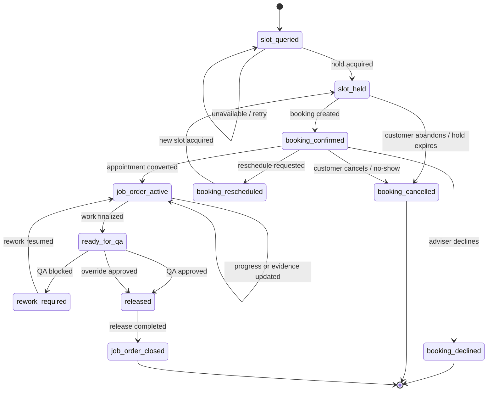

# AUTOCARE Operational State Machine

Date: 2026-04-18  
Purpose: Authoritative operational record-state reference for booking, appointment conversion, QA release, and timeline-triggering events

## Operational State Diagram

## Timeline Refresh Triggers

These should be modeled as side effects, not as inline business-state boxes:

- `booking.confirmed`
- `job_order.finalized`
- `quality_gate.released`
- `quality_gate.overridden`
- optional supporting insurance or back-job facts when they affect lifecycle visibility

## State Rules

- `slot_held` is temporary and should expire automatically if not confirmed.
- `booking_confirmed` is the intake-ready appointment state.
- `job_order_active` is the execution state for technician work and evidence capture.
- `ready_for_qa` is a pre-release state and must not skip human review.
- `released` means QA approved or approved override exists.
- `job_order_closed` is the terminal operational state after release is completed.

## Flow Contract Appendix

| Record / Transition | Actor | Owning Domain / Service | Required Inputs | Output / State Change | Transport | RBAC Gate |
| --- | --- | --- | --- | --- | --- | --- |
| Slot query and hold | `customer`, `service_adviser` | `main-service.bookings` | service type, date/time, vehicle | `slot_queried` to `slot_held` or retry | sync API | customer own booking / adviser |
| Booking create | `customer`, `service_adviser` | `main-service.bookings` | valid held slot, customer, vehicle | `booking_confirmed` | sync API | customer own booking / adviser |
| Reschedule / decline / cancel | `customer`, `service_adviser`, `super_admin` | `main-service.bookings` | existing booking, decision, optional new slot | `booking_rescheduled`, `booking_declined`, or `booking_cancelled` | sync API | owner/adviser/admin |
| Convert to job order | `service_adviser`, `super_admin` | `main-service.job-orders` | confirmed booking, adviser context | `job_order_active` | sync API | adviser/admin |
| Progress and evidence updates | `technician`, `super_admin` | `main-service.job-orders` | assigned job order, notes, photos | remain in `job_order_active` with more evidence | sync API | assigned technician/admin |
| Finalize work | `technician`, `service_adviser`, `super_admin` | `main-service.job-orders` | completed work, required evidence | `ready_for_qa` | sync API | assigned technician or adviser/admin |
| QA release / rework / override | `service_adviser`, `super_admin` | `main-service.quality-gates` | finalized work package, QA analysis, reviewer decision | `rework_required` or `released` | sync API + jobs | reviewer/admin |
| Job order close | `service_adviser`, `super_admin` | `main-service.job-orders` | released job order | `job_order_closed` | sync API | adviser/admin |
