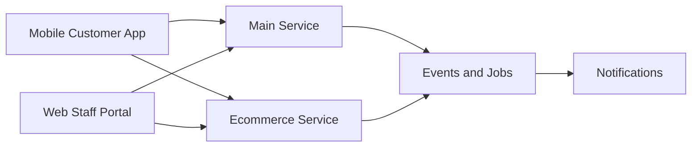
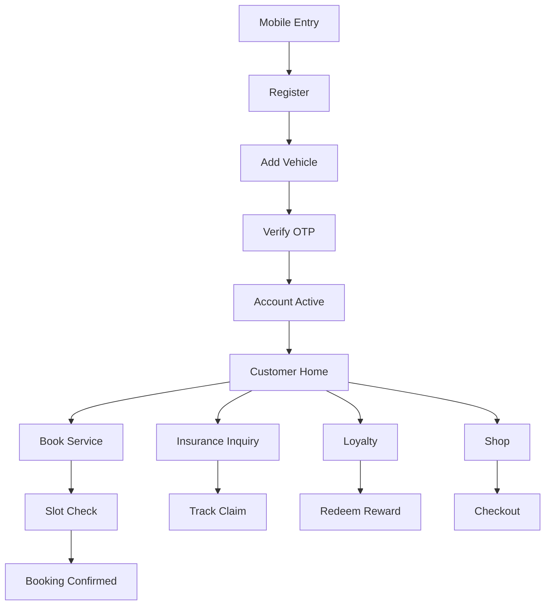
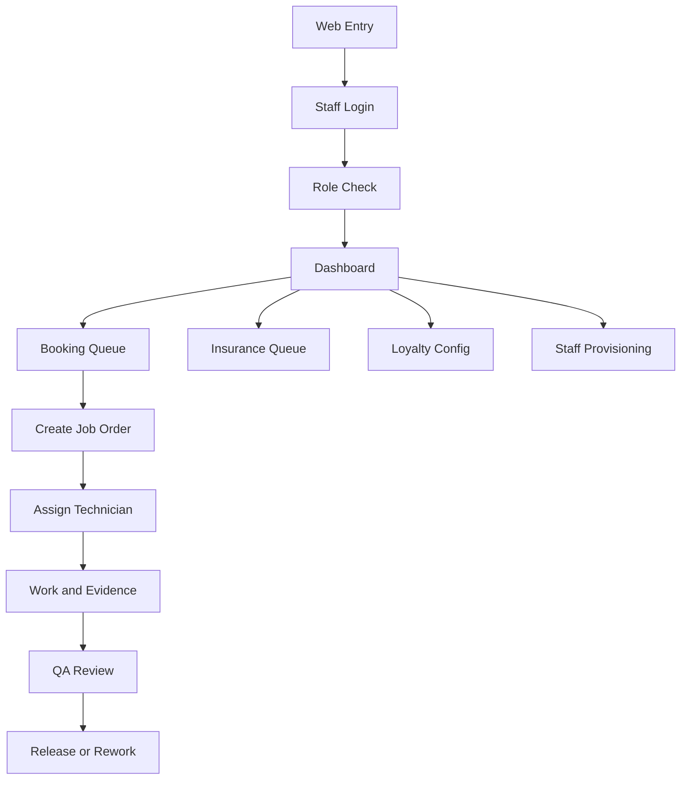
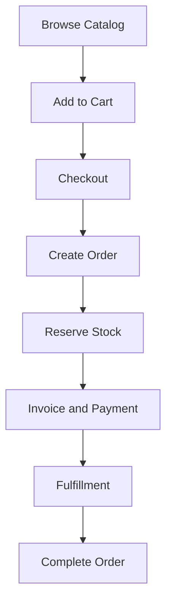
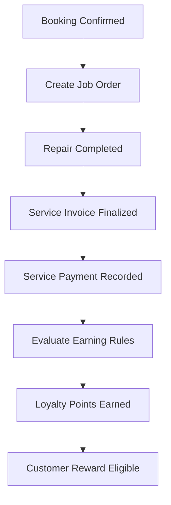
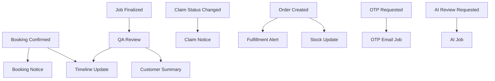

# AUTOCARE PM Flow Summary Pack

Date: 2026-04-18  
Purpose: PM-friendly summary flow set using Mermaid-safe diagrams and shorter labels

## Notes

- This pack is for reporting, review meetings, and presentation use.
- It intentionally uses **simple Mermaid flowcharts only** for better renderer compatibility.
- For engineering source-of-truth details, use:
  - [team-flow-engineering-source-of-truth.md](./team-flow-engineering-source-of-truth.md)
  - [team-flow-redraw-structure.md](./team-flow-redraw-structure.md)

## 1. System Overview

## 2. Customer Journey Summary

## 3. Staff/Admin Summary

## 4. Commerce Summary

## 5. Service Loyalty Summary

## 6. Async and Support Summary

## PM Talking Points

- `mobile` is for customers.
- `web` is for staff and admins.
- `main-service` owns operations like auth, bookings, job orders, QA, insurance, loyalty, and notifications.
- `ecommerce-service` owns shopping, orders, stock, and invoice tracking.
- loyalty points are earned from paid service work, not from ecommerce checkout.
- admins configure both reward definitions and earning rules for the loyalty program.
- Notifications, timeline refresh, and AI processing are support flows, not the main business-state owners.
- QA still requires human approval even when AI assistance exists.
