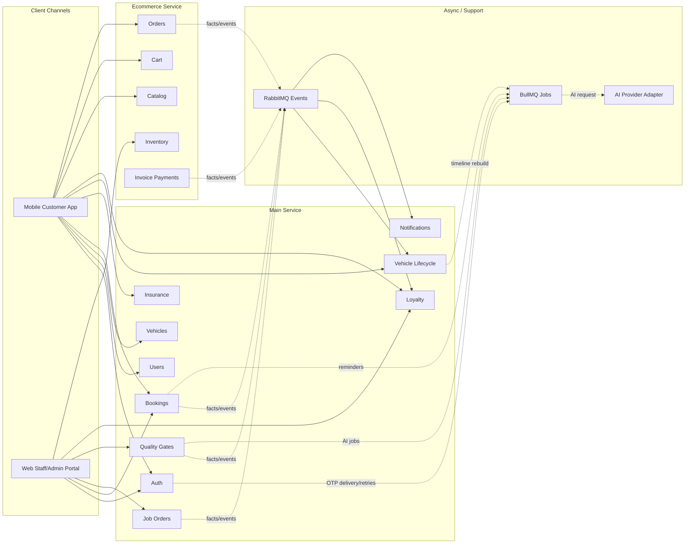
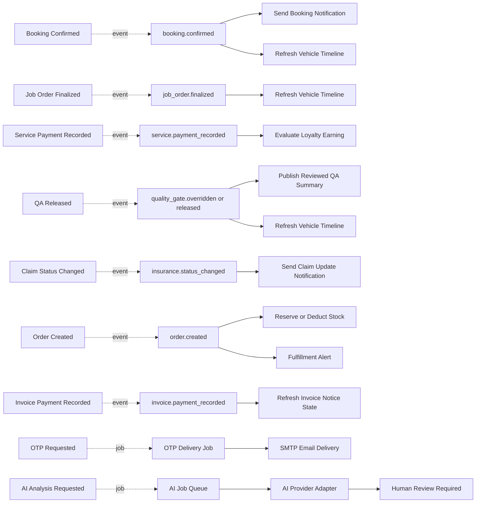

# AUTOCARE Clean Replacement Flow Structure

Date: 2026-04-18  
Purpose: Redraw-ready overview foundation for the team flow diagram set, aligned to the current AUTOCARE architecture and intended production target

## Position in the Documentation Pack

This file is the **overview foundation**, not the final engineering source of truth by itself.

Use it together with:

- [team-flow-engineering-source-of-truth.md](./team-flow-engineering-source-of-truth.md)
- [team-flow-customer-mobile-lifecycle.md](./team-flow-customer-mobile-lifecycle.md)
- [team-flow-staff-admin-web-lifecycle.md](./team-flow-staff-admin-web-lifecycle.md)
- [team-flow-operational-state-machine.md](./team-flow-operational-state-machine.md)
- [team-flow-commerce-state-machine.md](./team-flow-commerce-state-machine.md)
- [team-flow-async-orchestration.md](./team-flow-async-orchestration.md)

## How To Redraw This

Do not redraw the system as one giant end-to-end chain. Use this file as the top-level reference, then support it with the engineering docs listed above.

This overview is still useful for:

- client channels
- service ownership
- major journey entry points
- major async/support boundaries

## Redraw Rules

- Keep `mobile` and `web` in separate channel lanes.
- Keep `main-service` and `ecommerce-service` in separate backend lanes.
- Keep notifications, events, and jobs in a separate support/orchestration lane.
- Treat AI as an **assistive subflow**, never the final authority node.
- Treat claim status, job order status, and loyalty balance as **record states**, not isolated terminal nodes.
- Use direct flow lines only for synchronous actions.
- Use dotted or labeled async/event lines for:
  - timeline refresh
  - notifications
  - fulfillment alerts
  - analytics refresh
  - AI jobs

## 1. Channel and Ownership Overview

## 2. Customer Mobile Lifecycle

Use this as the customer-facing redraw. This should be one clean diagram, not mixed with staff operations.

```mermaid
flowchart LR
  APP[Mobile App Entry] --> REG[Start Registration]
  REG --> IDENTITY[Capture Identity and Contact Info]
  IDENTITY --> VEHFORM[Capture Vehicle Details]
  VEHFORM --> CREATEPENDING[Create Pending Account]
  CREATEPENDING --> SENDOTP[Send Email OTP]
  SENDOTP --> OTP[Enter OTP]
  OTP --> OTPCHECK{OTP Valid?}

  OTPCHECK -- No --> OTPFAIL[Show OTP Error / Retry / Resend]
  OTPFAIL --> OTP

  OTPCHECK -- Yes --> ACTIVATE[Activate Account and Issue Session]
  ACTIVATE --> SAVEONBOARD[Persist Customer Profile and First Vehicle]
  SAVEONBOARD --> SAVEOK{Save Successful?}

  SAVEOK -- No --> COMPLETE[Retry Onboarding Completion]
  COMPLETE --> SAVEONBOARD

  SAVEOK -- Yes --> DASH[Customer Home]

  DASH --> BOOKSTART[Start Booking]
  BOOKSTART --> SERVICE[Select Service Type]
  SERVICE --> SLOTQ[Query Available Slots]
  SLOTQ --> PICKSLOT[Choose Date and Time]
  PICKSLOT --> HOLD[Attempt Slot Hold / Reservation]
  HOLD --> SLOTOK{Slot Still Available?}

  SLOTOK -- No --> ALT[Show Alternate Slots / Retry]
  ALT --> SLOTQ

  SLOTOK -- Yes --> CREATEBOOK[Create Booking]
  CREATEBOOK --> BOOKCONF[Booking Confirmed]
  BOOKCONF --> TIMELINE[View Timeline]

  DASH --> INSSTART[Start Insurance Inquiry]
  INSSTART --> AUTOFILL[Auto-Fill Vehicle and Owner]
  AUTOFILL --> INSFORM[Submit Inquiry Form]
  INSFORM --> CLAIMVIEW[Track Claim Status]

  DASH --> LOYALTY[View Loyalty Dashboard]
  LOYALTY --> BAL[View Points Balance]
  BAL --> REDEEM[Select Reward / Redeem]
  REDEEM --> ENOUGH{Points Sufficient?}
  ENOUGH -- No --> REDEEMFAIL[Show Insufficient Points]
  ENOUGH -- Yes --> APPLY[Apply Reward to Valid Transaction]
  APPLY --> REDEEMOK[Redemption Recorded]

  DASH --> SHOP[Browse Ecommerce]
  SHOP --> CATALOG[Browse Catalog]
  CATALOG --> CART[Add to Cart]
  CART --> CHECKOUT[Checkout]
  CHECKOUT --> ORDEROK[Order Created]
```

## 3. Staff/Admin Web Lifecycle

Use this as the staff/admin redraw. Do not mix this with customer registration.

```mermaid
flowchart LR
  WEB[Web Portal Entry] --> LOGIN[Staff Login]
  LOGIN --> AUTHOK{Authenticated?}

  AUTHOK -- No --> LOGINFAIL[Show Login Error]
  LOGINFAIL --> LOGIN

  AUTHOK -- Yes --> ROLECHECK{Allowed Staff Role?}
  ROLECHECK -- No --> ACCESSDENY[Reject Non-Staff Access]
  ROLECHECK -- Yes --> DASH[Staff/Admin Dashboard]

  DASH --> CAL[Calendar / Booking Queue]
  CAL --> APPT[View Appointment]
  APPT --> DECIDE{Confirm / Reschedule / Decline?}
  DECIDE --> JO[Convert Confirmed Booking to Job Order]
  JO --> ASSIGN[Assign Technician]
  ASSIGN --> ACTIVE[Job Order Active]
  ACTIVE --> PROGRESS[Update Progress / Diagnosis]
  PROGRESS --> EVIDENCE[Upload Photo Evidence]
  EVIDENCE --> FINALIZE[Finalize Work]
  FINALIZE --> QAQUEUE[Send to QA Review]

  QAQUEUE --> QAASSIST[AI-Assisted QA Analysis]
  QAASSIST --> HUMANQA[Human Reviewer Decision]
  HUMANQA --> RELEASE{Release Approved?}
  RELEASE -- No --> REWORK[Return for Rework / Override Process]
  RELEASE -- Yes --> CLOSE[Close Job Order]

  DASH --> CLAIMADMIN[Review Insurance Queue]
  CLAIMADMIN --> CLAIMSTATE[Update Claim Status]

  DASH --> LOYALTYADMIN[Configure Rewards and Earning Rules]

  DASH --> STAFFADMIN[Provision Staff Accounts]
  STAFFADMIN --> PENDING[Staff Pending Activation]
```

## 4. Async Side Effects and Supporting Services

This redraw should show what happens **around** the main user flows without pretending it is one synchronous chain.

## Recommended Node Set for the Redrawn Version

Use these exact major sections as the redraw backbone.

### Customer Mobile

- Mobile App Entry
- Start Registration
- Capture Identity and Contact Info
- Capture Vehicle Details
- Create Pending Account
- Send Email OTP
- Enter OTP
- Activate Account and Issue Session
- Persist Customer Profile and First Vehicle
- Customer Home
- Start Booking
- Start Insurance Inquiry
- View Loyalty Dashboard
- Browse Ecommerce
- View Timeline

### Staff/Admin Web

- Web Portal Entry
- Staff Login
- Role Validation
- Staff/Admin Dashboard
- Calendar / Booking Queue
- Convert to Job Order
- Assign Technician
- Job Order Active
- QA Review
- Insurance Queue
- Loyalty Administration
- Configure Rewards and Earning Rules
- Staff Provisioning

### Supporting/Async

- Notification Service
- Timeline Refresh
- RabbitMQ Events
- BullMQ Jobs
- AI Provider Adapter
- SMTP Email Delivery
- Inventory Reservation/Deduction
- Fulfillment Alert

## Important Redraw Corrections

When your team redraws the diagram, make these corrections explicitly:

1. Replace `Trigger 2FA` with:
   - `Create Pending Account`
   - `Send OTP`
   - `Enter OTP`
   - `Activate Account`

2. Replace direct `Registration Complete -> Service Booking` with:
   - `Activate Account`
   - `Persist Customer Profile and First Vehicle`
   - `Customer Home`
   - `Start Booking`

3. Replace `Stock Check -> Deduct Stock -> Order Placed` with:
   - `Checkout`
   - `Create Order`
   - `Reserve/Deduct Stock`
   - `Order Created`

4. Replace the QA AI lane with:
   - `Upload Evidence`
   - `AI-Assisted QA Analysis`
   - `Human Reviewer Decision`
   - `Release / Rework / Override`

5. Replace `Claim Pending / Claim Quoted / Claim Issued` branch boxes with a single:
   - `Insurance Claim Record`
   - `Claim Status = Pending | Quoted | Issued`

6. Move all notifications out of the main business line and into async side effects.

7. Move loyalty earning to:
   - `Successful Service Payment`
   - `service.payment_recorded`
   - `Evaluate Loyalty Earning`
   and remove loyalty earning from ecommerce payment flow.

## Recommended Final Deliverables for the Team

If your team wants this to become the official engineering documentation set, use this overview together with the full pack:

1. **System ownership overview**  
   [team-flow-redraw-structure.md](./team-flow-redraw-structure.md)
2. **Customer mobile lifecycle**  
   [team-flow-customer-mobile-lifecycle.md](./team-flow-customer-mobile-lifecycle.md)
3. **Staff/admin web lifecycle**  
   [team-flow-staff-admin-web-lifecycle.md](./team-flow-staff-admin-web-lifecycle.md)
4. **Operational state machine**  
   [team-flow-operational-state-machine.md](./team-flow-operational-state-machine.md)
5. **Commerce state machine**  
   [team-flow-commerce-state-machine.md](./team-flow-commerce-state-machine.md)
6. **Async orchestration and support services**  
   [team-flow-async-orchestration.md](./team-flow-async-orchestration.md)

That pack is much closer to a production-grade system explanation than a single mixed master flow.
