# AUTOCARE Staff and Admin Web Lifecycle

Date: 2026-04-18  
Purpose: Staff/admin portal lifecycle reference for operations, QA, insurance handling, and privileged administration

## Staff/Admin Flow

```mermaid
flowchart LR
  WEB[Web Portal Entry] --> LOGIN[Staff Login]
  LOGIN --> AUTHOK{Authenticated?}

  AUTHOK -- No --> LOGINFAIL[Show Login Error]
  LOGINFAIL --> LOGIN

  AUTHOK -- Yes --> ROLECHECK{Allowed Staff Role?}
  ROLECHECK -- No --> ACCESSDENY[Reject Non-Staff Access]
  ROLECHECK -- Yes --> DASH[Staff/Admin Dashboard]

  DASH --> CAL[Calendar / Booking Queue]
  CAL --> APPT[View Appointment]
  APPT --> DECIDE{Confirm / Reschedule / Decline?}
  DECIDE --> JO[Convert Confirmed Booking to Job Order]
  JO --> ASSIGN[Assign Technician]
  ASSIGN --> ACTIVE[Job Order Active]
  ACTIVE --> PROGRESS[Update Progress / Diagnosis]
  PROGRESS --> EVIDENCE[Upload Photo Evidence]
  EVIDENCE --> FINALIZE[Finalize Work]
  FINALIZE --> QAQUEUE[Send to QA Review]

  QAQUEUE --> QAASSIST[AI-Assisted QA Analysis]
  QAASSIST --> HUMANQA[Human Reviewer Decision]
  HUMANQA --> RELEASE{Release Approved?}
  RELEASE -- No --> REWORK[Return for Rework / Override Process]
  RELEASE -- Yes --> CLOSE[Close Job Order]

  DASH --> CLAIMADMIN[Review Insurance Queue]
  CLAIMADMIN --> CLAIMSTATE[Update Claim Status]

  DASH --> LOYALTYADMIN[Configure Rewards / Monitor Redemptions]

  DASH --> STAFFADMIN[Provision Staff Accounts]
  STAFFADMIN --> PENDING[Staff Pending Activation]
```

## Notes

- `customer` should never remain in this portal after successful authentication.
- `service_adviser` owns intake, booking decisions, and job-order coordination.
- `technician` owns work progress and evidence, not staff provisioning or final release authority.
- `super_admin` owns staff provisioning, deactivation, and QA override authority.

## Flow Contract Appendix

| Segment | Actor | Owning Domain / Service | Required Inputs | Output / State Change | Transport | RBAC Gate |
| --- | --- | --- | --- | --- | --- | --- |
| Staff login | `technician`, `service_adviser`, `super_admin` | `main-service.auth` | email, password | authenticated staff session | sync API | staff roles only |
| Booking decision | `service_adviser`, `super_admin` | `main-service.bookings` | booking reference, decision, optional new slot | booking confirmed, rescheduled, or declined | sync API | adviser/admin |
| Convert to job order | `service_adviser`, `super_admin` | `main-service.job-orders` | confirmed booking, adviser identity | job order created | sync API | adviser/admin |
| Technician assignment | `service_adviser`, `super_admin` | `main-service.job-orders` | job-order reference, technician identity | technician assignment recorded | sync API | adviser/admin |
| Progress and evidence | `technician`, `super_admin` | `main-service.job-orders` | job-order reference, progress note, photo evidence | work state updated | sync API | assigned technician/admin |
| QA review | `service_adviser`, `super_admin` | `main-service.quality-gates` | finalized work, evidence, QA annotations | release approved, blocked, or sent for rework | sync API + jobs | reviewer/admin |
| Insurance queue update | `service_adviser`, `super_admin` | `main-service.insurance` | claim reference, new status, optional note | insurance status updated | sync API | adviser/admin |
| Staff provisioning | `super_admin` | `main-service.auth`, `main-service.users` | staff identity, role, staff code | pending staff account created | sync API | super admin only |
